[English](README.md) · [العربية](i18n/README.ar.md) · [Español](i18n/README.es.md) · [Français](i18n/README.fr.md) · [日本語](i18n/README.ja.md) · [한국어](i18n/README.ko.md) · [Tiếng Việt](i18n/README.vi.md) · [中文 (简体)](i18n/README.zh-Hans.md) · [中文（繁體）](i18n/README.zh-Hant.md) · [Deutsch](i18n/README.de.md) · [Русский](i18n/README.ru.md)


# LazyLearn

Knowledge + skill, unrushed.

[](https://learn.lazying.art)


<!-- POCKETPOLYGLOT_MAX_LANGUAGE:START -->
## PocketPolyglot Maximum-Language Editions

PocketPolyglot/LinguaLeaf builds pocket-size interlinear readers with ruby, pinyin, grammar coloring, and maximum available language layers.

The `Read` links open the LazyLearn PDF.js reader with PDFs streamed from GitHub raw URLs.

| Preview | Book | Edition | Color | Black-white |
| --- | --- | --- | --- | --- |
| 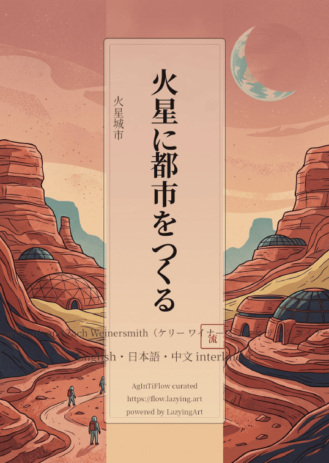 | `a-city-on-mars` | English main · 日本語 · 中文 | [Read](https://learn.lazying.art/pdf-reader.html?path=docs/pocketpolyglot/books/en-jp-zh/a-city-on-mars/en-main-jp-zh/color/A%20City%20on%20Mars%EF%BC%88%E6%97%A5%E6%96%87%E3%83%BB%E4%B8%AD%E6%96%87%E6%B3%A8%EF%BC%89%E3%83%BB%E6%9C%80%E5%A4%A7%E8%AA%9E%E7%A8%AE%E3%83%BB%E5%A4%A7%E5%AD%97%E7%89%88.pdf&title=A%20City%20on%20Mars%EF%BC%88%E6%97%A5%E6%96%87%E3%83%BB%E4%B8%AD%E6%96%87%E6%B3%A8%EF%BC%89) | [Read](https://learn.lazying.art/pdf-reader.html?path=docs/pocketpolyglot/books/en-jp-zh/a-city-on-mars/en-main-jp-zh/blackwhite/A%20City%20on%20Mars%EF%BC%88%E6%97%A5%E6%96%87%E3%83%BB%E4%B8%AD%E6%96%87%E6%B3%A8%E3%83%BB%E9%BB%91%E7%99%BD%EF%BC%89%E3%83%BB%E6%9C%80%E5%A4%A7%E8%AA%9E%E7%A8%AE%E3%83%BB%E5%A4%A7%E5%AD%97%E7%89%88.pdf&title=A%20City%20on%20Mars%EF%BC%88%E6%97%A5%E6%96%87%E3%83%BB%E4%B8%AD%E6%96%87%E6%B3%A8%EF%BC%89%20black-white) |
|  | `bible` | English main · 日本語 · 中文 | [Read](https://learn.lazying.art/pdf-reader.html?path=docs/pocketpolyglot/books/en-jp-zh/bible/en-main-jp-zh/color/The%20Holy%20Bible%EF%BC%88%E6%97%A5%E6%96%87%E3%83%BB%E4%B8%AD%E6%96%87%E6%B3%A8%EF%BC%89%E3%83%BB%E6%9C%80%E5%A4%A7%E8%AA%9E%E7%A8%AE%E3%83%BB%E5%A4%A7%E5%AD%97%E7%89%88.pdf&title=The%20Holy%20Bible%EF%BC%88%E6%97%A5%E6%96%87%E3%83%BB%E4%B8%AD%E6%96%87%E6%B3%A8%EF%BC%89) | [Read](https://learn.lazying.art/pdf-reader.html?path=docs/pocketpolyglot/books/en-jp-zh/bible/en-main-jp-zh/blackwhite/The%20Holy%20Bible%EF%BC%88%E6%97%A5%E6%96%87%E3%83%BB%E4%B8%AD%E6%96%87%E6%B3%A8%E3%83%BB%E9%BB%91%E7%99%BD%EF%BC%89%E3%83%BB%E6%9C%80%E5%A4%A7%E8%AA%9E%E7%A8%AE%E3%83%BB%E5%A4%A7%E5%AD%97%E7%89%88.pdf&title=The%20Holy%20Bible%EF%BC%88%E6%97%A5%E6%96%87%E3%83%BB%E4%B8%AD%E6%96%87%E6%B3%A8%EF%BC%89%20black-white) |
|  | `botchan` | English main · 日本語 · 中文 | [Read](https://learn.lazying.art/pdf-reader.html?path=docs/pocketpolyglot/books/en-jp-zh/botchan/en-main-jp-zh/color/Botchan%EF%BC%88%E6%97%A5%E6%96%87%E3%83%BB%E4%B8%AD%E6%96%87%E6%B3%A8%EF%BC%89%E3%83%BB%E6%9C%80%E5%A4%A7%E8%AA%9E%E7%A8%AE%E3%83%BB%E5%A4%A7%E5%AD%97%E7%89%88.pdf&title=Botchan%EF%BC%88%E6%97%A5%E6%96%87%E3%83%BB%E4%B8%AD%E6%96%87%E6%B3%A8%EF%BC%89) | [Read](https://learn.lazying.art/pdf-reader.html?path=docs/pocketpolyglot/books/en-jp-zh/botchan/en-main-jp-zh/blackwhite/Botchan%EF%BC%88%E6%97%A5%E6%96%87%E3%83%BB%E4%B8%AD%E6%96%87%E6%B3%A8%E3%83%BB%E9%BB%91%E7%99%BD%EF%BC%89%E3%83%BB%E6%9C%80%E5%A4%A7%E8%AA%9E%E7%A8%AE%E3%83%BB%E5%A4%A7%E5%AD%97%E7%89%88.pdf&title=Botchan%EF%BC%88%E6%97%A5%E6%96%87%E3%83%BB%E4%B8%AD%E6%96%87%E6%B3%A8%EF%BC%89%20black-white) |
|  | `genji-modern` | English main · 日本語 · 中文 | [Read](https://learn.lazying.art/pdf-reader.html?path=docs/pocketpolyglot/books/en-jp-zh/genji-modern/en-main-jp-zh/color/The%20Tale%20of%20Genji%EF%BC%88%E6%97%A5%E6%96%87%E3%83%BB%E4%B8%AD%E6%96%87%E6%B3%A8%EF%BC%89%E3%83%BB%E6%9C%80%E5%A4%A7%E8%AA%9E%E7%A8%AE%E3%83%BB%E5%A4%A7%E5%AD%97%E7%89%88.pdf&title=The%20Tale%20of%20Genji%EF%BC%88%E6%97%A5%E6%96%87%E3%83%BB%E4%B8%AD%E6%96%87%E6%B3%A8%EF%BC%89) | [Read](https://learn.lazying.art/pdf-reader.html?path=docs/pocketpolyglot/books/en-jp-zh/genji-modern/en-main-jp-zh/blackwhite/The%20Tale%20of%20Genji%EF%BC%88%E6%97%A5%E6%96%87%E3%83%BB%E4%B8%AD%E6%96%87%E6%B3%A8%E3%83%BB%E9%BB%91%E7%99%BD%EF%BC%89%E3%83%BB%E6%9C%80%E5%A4%A7%E8%AA%9E%E7%A8%AE%E3%83%BB%E5%A4%A7%E5%AD%97%E7%89%88.pdf&title=The%20Tale%20of%20Genji%EF%BC%88%E6%97%A5%E6%96%87%E3%83%BB%E4%B8%AD%E6%96%87%E6%B3%A8%EF%BC%89%20black-white) |
|  | `gone-with-the-wind` | English main · 日本語 · 中文 | [Read](https://learn.lazying.art/pdf-reader.html?path=docs/pocketpolyglot/books/en-jp-zh/gone-with-the-wind/en-main-jp-zh/color/Gone%20With%20the%20Wind%EF%BC%88%E6%97%A5%E6%96%87%E3%83%BB%E4%B8%AD%E6%96%87%E6%B3%A8%EF%BC%89%E3%83%BB%E6%9C%80%E5%A4%A7%E8%AA%9E%E7%A8%AE%E3%83%BB%E5%A4%A7%E5%AD%97%E7%89%88.pdf&title=Gone%20With%20the%20Wind%EF%BC%88%E6%97%A5%E6%96%87%E3%83%BB%E4%B8%AD%E6%96%87%E6%B3%A8%EF%BC%89) | [Read](https://learn.lazying.art/pdf-reader.html?path=docs/pocketpolyglot/books/en-jp-zh/gone-with-the-wind/en-main-jp-zh/blackwhite/Gone%20With%20the%20Wind%EF%BC%88%E6%97%A5%E6%96%87%E3%83%BB%E4%B8%AD%E6%96%87%E6%B3%A8%E3%83%BB%E9%BB%91%E7%99%BD%EF%BC%89%E3%83%BB%E6%9C%80%E5%A4%A7%E8%AA%9E%E7%A8%AE%E3%83%BB%E5%A4%A7%E5%AD%97%E7%89%88.pdf&title=Gone%20With%20the%20Wind%EF%BC%88%E6%97%A5%E6%96%87%E3%83%BB%E4%B8%AD%E6%96%87%E6%B3%A8%EF%BC%89%20black-white) |
| 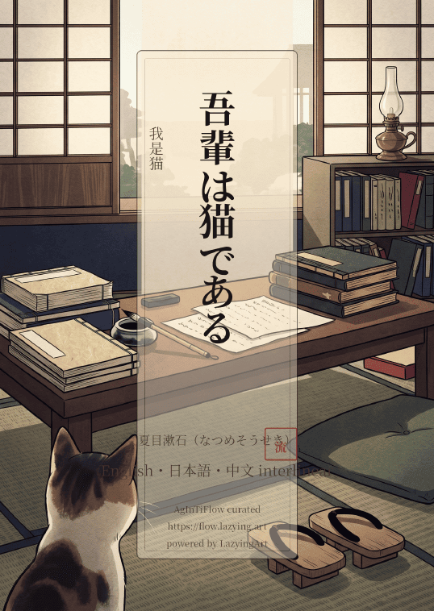 | `i-am-a-cat` | English main · 日本語 · 中文 | [Read](https://learn.lazying.art/pdf-reader.html?path=docs/pocketpolyglot/books/en-jp-zh/i-am-a-cat/en-main-jp-zh/color/I%20Am%20a%20Cat%EF%BC%88%E6%97%A5%E6%96%87%E3%83%BB%E4%B8%AD%E6%96%87%E6%B3%A8%EF%BC%89%E3%83%BB%E6%9C%80%E5%A4%A7%E8%AA%9E%E7%A8%AE%E3%83%BB%E5%A4%A7%E5%AD%97%E7%89%88.pdf&title=I%20Am%20a%20Cat%EF%BC%88%E6%97%A5%E6%96%87%E3%83%BB%E4%B8%AD%E6%96%87%E6%B3%A8%EF%BC%89) | [Read](https://learn.lazying.art/pdf-reader.html?path=docs/pocketpolyglot/books/en-jp-zh/i-am-a-cat/en-main-jp-zh/blackwhite/I%20Am%20a%20Cat%EF%BC%88%E6%97%A5%E6%96%87%E3%83%BB%E4%B8%AD%E6%96%87%E6%B3%A8%E3%83%BB%E9%BB%91%E7%99%BD%EF%BC%89%E3%83%BB%E6%9C%80%E5%A4%A7%E8%AA%9E%E7%A8%AE%E3%83%BB%E5%A4%A7%E5%AD%97%E7%89%88.pdf&title=I%20Am%20a%20Cat%EF%BC%88%E6%97%A5%E6%96%87%E3%83%BB%E4%B8%AD%E6%96%87%E6%B3%A8%EF%BC%89%20black-white) |
| 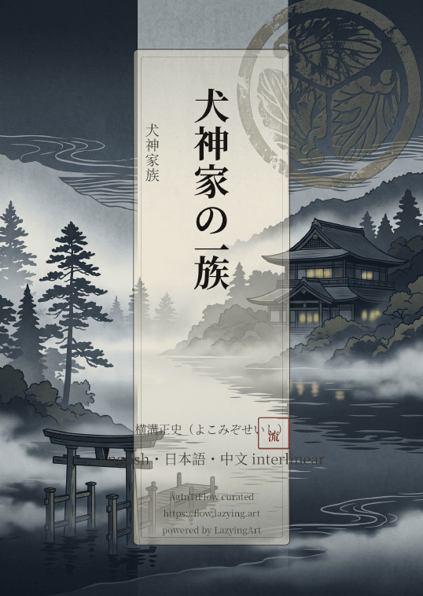 | `inugami-curse` | English main · 日本語 · 中文 | [Read](https://learn.lazying.art/pdf-reader.html?path=docs/pocketpolyglot/books/en-jp-zh/inugami-curse/en-main-jp-zh/color/The%20Inugami%20Curse%EF%BC%88%E6%97%A5%E6%96%87%E3%83%BB%E4%B8%AD%E6%96%87%E6%B3%A8%EF%BC%89%E3%83%BB%E6%9C%80%E5%A4%A7%E8%AA%9E%E7%A8%AE%E3%83%BB%E5%A4%A7%E5%AD%97%E7%89%88.pdf&title=The%20Inugami%20Curse%EF%BC%88%E6%97%A5%E6%96%87%E3%83%BB%E4%B8%AD%E6%96%87%E6%B3%A8%EF%BC%89) | [Read](https://learn.lazying.art/pdf-reader.html?path=docs/pocketpolyglot/books/en-jp-zh/inugami-curse/en-main-jp-zh/blackwhite/The%20Inugami%20Curse%EF%BC%88%E6%97%A5%E6%96%87%E3%83%BB%E4%B8%AD%E6%96%87%E6%B3%A8%E3%83%BB%E9%BB%91%E7%99%BD%EF%BC%89%E3%83%BB%E6%9C%80%E5%A4%A7%E8%AA%9E%E7%A8%AE%E3%83%BB%E5%A4%A7%E5%AD%97%E7%89%88.pdf&title=The%20Inugami%20Curse%EF%BC%88%E6%97%A5%E6%96%87%E3%83%BB%E4%B8%AD%E6%96%87%E6%B3%A8%EF%BC%89%20black-white) |
| 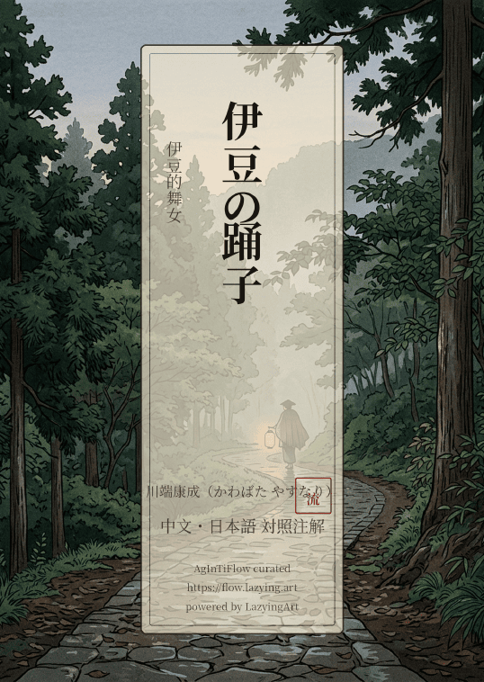 | `izu-no-odori` | English main · 日本語 · 中文 | [Read](https://learn.lazying.art/pdf-reader.html?path=docs/pocketpolyglot/books/en-jp-zh/izu-no-odori/en-main-jp-zh/color/The%20Dancing%20Girl%20of%20Izu%EF%BC%88%E6%97%A5%E6%96%87%E3%83%BB%E4%B8%AD%E6%96%87%E6%B3%A8%EF%BC%89%E3%83%BB%E6%9C%80%E5%A4%A7%E8%AA%9E%E7%A8%AE%E3%83%BB%E5%A4%A7%E5%AD%97%E7%89%88.pdf&title=The%20Dancing%20Girl%20of%20Izu%EF%BC%88%E6%97%A5%E6%96%87%E3%83%BB%E4%B8%AD%E6%96%87%E6%B3%A8%EF%BC%89) | [Read](https://learn.lazying.art/pdf-reader.html?path=docs/pocketpolyglot/books/en-jp-zh/izu-no-odori/en-main-jp-zh/blackwhite/The%20Dancing%20Girl%20of%20Izu%EF%BC%88%E6%97%A5%E6%96%87%E3%83%BB%E4%B8%AD%E6%96%87%E6%B3%A8%E3%83%BB%E9%BB%91%E7%99%BD%EF%BC%89%E3%83%BB%E6%9C%80%E5%A4%A7%E8%AA%9E%E7%A8%AE%E3%83%BB%E5%A4%A7%E5%AD%97%E7%89%88.pdf&title=The%20Dancing%20Girl%20of%20Izu%EF%BC%88%E6%97%A5%E6%96%87%E3%83%BB%E4%B8%AD%E6%96%87%E6%B3%A8%EF%BC%89%20black-white) |
| 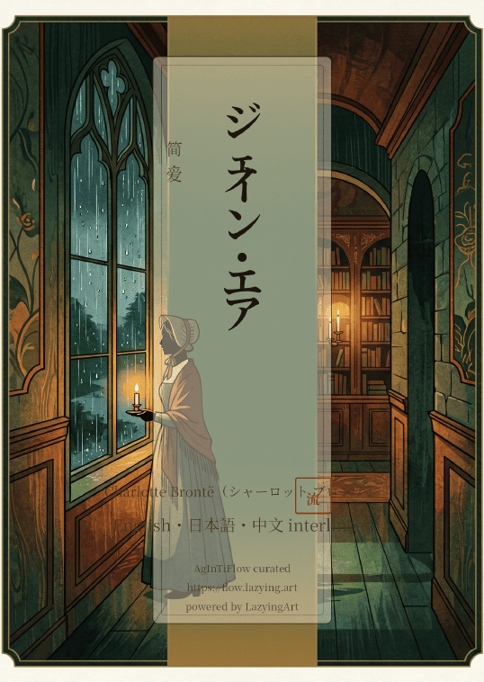 | `jane-eyre` | English main · 日本語 · 中文 | [Read](https://learn.lazying.art/pdf-reader.html?path=docs/pocketpolyglot/books/en-jp-zh/jane-eyre/en-main-jp-zh/color/Jane%20Eyre%EF%BC%88%E6%97%A5%E6%96%87%E3%83%BB%E4%B8%AD%E6%96%87%E6%B3%A8%EF%BC%89%E3%83%BB%E6%9C%80%E5%A4%A7%E8%AA%9E%E7%A8%AE%E3%83%BB%E5%A4%A7%E5%AD%97%E7%89%88.pdf&title=Jane%20Eyre%EF%BC%88%E6%97%A5%E6%96%87%E3%83%BB%E4%B8%AD%E6%96%87%E6%B3%A8%EF%BC%89) | [Read](https://learn.lazying.art/pdf-reader.html?path=docs/pocketpolyglot/books/en-jp-zh/jane-eyre/en-main-jp-zh/blackwhite/Jane%20Eyre%EF%BC%88%E6%97%A5%E6%96%87%E3%83%BB%E4%B8%AD%E6%96%87%E6%B3%A8%E3%83%BB%E9%BB%91%E7%99%BD%EF%BC%89%E3%83%BB%E6%9C%80%E5%A4%A7%E8%AA%9E%E7%A8%AE%E3%83%BB%E5%A4%A7%E5%AD%97%E7%89%88.pdf&title=Jane%20Eyre%EF%BC%88%E6%97%A5%E6%96%87%E3%83%BB%E4%B8%AD%E6%96%87%E6%B3%A8%EF%BC%89%20black-white) |
|  | `japanese-history` | English main · 日本語 · 中文 | [Read](https://learn.lazying.art/pdf-reader.html?path=docs/pocketpolyglot/books/en-jp-zh/japanese-history/en-main-jp-zh/color/A%20Concise%20History%20of%20Japan%EF%BC%88%E6%97%A5%E6%96%87%E3%83%BB%E4%B8%AD%E6%96%87%E6%B3%A8%EF%BC%89%E3%83%BB%E6%9C%80%E5%A4%A7%E8%AA%9E%E7%A8%AE%E3%83%BB%E5%A4%A7%E5%AD%97%E7%89%88.pdf&title=A%20Concise%20History%20of%20Japan%EF%BC%88%E6%97%A5%E6%96%87%E3%83%BB%E4%B8%AD%E6%96%87%E6%B3%A8%EF%BC%89) | [Read](https://learn.lazying.art/pdf-reader.html?path=docs/pocketpolyglot/books/en-jp-zh/japanese-history/en-main-jp-zh/blackwhite/A%20Concise%20History%20of%20Japan%EF%BC%88%E6%97%A5%E6%96%87%E3%83%BB%E4%B8%AD%E6%96%87%E6%B3%A8%E3%83%BB%E9%BB%91%E7%99%BD%EF%BC%89%E3%83%BB%E6%9C%80%E5%A4%A7%E8%AA%9E%E7%A8%AE%E3%83%BB%E5%A4%A7%E5%AD%97%E7%89%88.pdf&title=A%20Concise%20History%20of%20Japan%EF%BC%88%E6%97%A5%E6%96%87%E3%83%BB%E4%B8%AD%E6%96%87%E6%B3%A8%EF%BC%89%20black-white) |
|  | `kinkakuji` | English main · 日本語 · 中文 | [Read](https://learn.lazying.art/pdf-reader.html?path=docs/pocketpolyglot/books/en-jp-zh/kinkakuji/en-main-jp-zh/color/The%20Temple%20of%20the%20Golden%20Pavilion%EF%BC%88%E6%97%A5%E6%96%87%E3%83%BB%E4%B8%AD%E6%96%87%E6%B3%A8%EF%BC%89%E3%83%BB%E6%9C%80%E5%A4%A7%E8%AA%9E%E7%A8%AE%E3%83%BB%E5%A4%A7%E5%AD%97%E7%89%88.pdf&title=The%20Temple%20of%20the%20Golden%20Pavilion%EF%BC%88%E6%97%A5%E6%96%87%E3%83%BB%E4%B8%AD%E6%96%87%E6%B3%A8%EF%BC%89) | [Read](https://learn.lazying.art/pdf-reader.html?path=docs/pocketpolyglot/books/en-jp-zh/kinkakuji/en-main-jp-zh/blackwhite/The%20Temple%20of%20the%20Golden%20Pavilion%EF%BC%88%E6%97%A5%E6%96%87%E3%83%BB%E4%B8%AD%E6%96%87%E6%B3%A8%E3%83%BB%E9%BB%91%E7%99%BD%EF%BC%89%E3%83%BB%E6%9C%80%E5%A4%A7%E8%AA%9E%E7%A8%AE%E3%83%BB%E5%A4%A7%E5%AD%97%E7%89%88.pdf&title=The%20Temple%20of%20the%20Golden%20Pavilion%EF%BC%88%E6%97%A5%E6%96%87%E3%83%BB%E4%B8%AD%E6%96%87%E6%B3%A8%EF%BC%89%20black-white) |
| 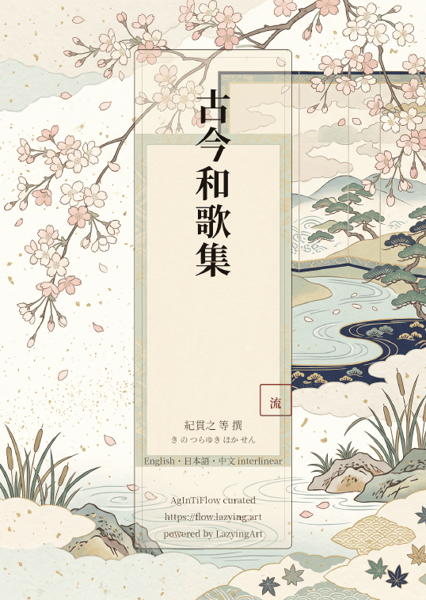 | `kokin-wakashu` | English main · 日本語 · 中文 | [Read](https://learn.lazying.art/pdf-reader.html?path=docs/pocketpolyglot/books/en-jp-zh/kokin-wakashu/en-main-jp-zh/color/Kokin%20Wakashu%EF%BC%88%E6%97%A5%E6%96%87%E3%83%BB%E4%B8%AD%E6%96%87%E6%B3%A8%EF%BC%89%E3%83%BB%E6%9C%80%E5%A4%A7%E8%AA%9E%E7%A8%AE%E3%83%BB%E5%A4%A7%E5%AD%97%E7%89%88.pdf&title=Kokin%20Wakashu%EF%BC%88%E6%97%A5%E6%96%87%E3%83%BB%E4%B8%AD%E6%96%87%E6%B3%A8%EF%BC%89) | [Read](https://learn.lazying.art/pdf-reader.html?path=docs/pocketpolyglot/books/en-jp-zh/kokin-wakashu/en-main-jp-zh/blackwhite/Kokin%20Wakashu%EF%BC%88%E6%97%A5%E6%96%87%E3%83%BB%E4%B8%AD%E6%96%87%E6%B3%A8%E3%83%BB%E9%BB%91%E7%99%BD%EF%BC%89%E3%83%BB%E6%9C%80%E5%A4%A7%E8%AA%9E%E7%A8%AE%E3%83%BB%E5%A4%A7%E5%AD%97%E7%89%88.pdf&title=Kokin%20Wakashu%EF%BC%88%E6%97%A5%E6%96%87%E3%83%BB%E4%B8%AD%E6%96%87%E6%B3%A8%EF%BC%89%20black-white) |
|  | `kokoro` | English main · 日本語 · 中文 | [Read](https://learn.lazying.art/pdf-reader.html?path=docs/pocketpolyglot/books/en-jp-zh/kokoro/en-main-jp-zh/color/Kokoro%EF%BC%88%E6%97%A5%E6%96%87%E3%83%BB%E4%B8%AD%E6%96%87%E6%B3%A8%EF%BC%89%E3%83%BB%E6%9C%80%E5%A4%A7%E8%AA%9E%E7%A8%AE%E3%83%BB%E5%A4%A7%E5%AD%97%E7%89%88.pdf&title=Kokoro%EF%BC%88%E6%97%A5%E6%96%87%E3%83%BB%E4%B8%AD%E6%96%87%E6%B3%A8%EF%BC%89) | [Read](https://learn.lazying.art/pdf-reader.html?path=docs/pocketpolyglot/books/en-jp-zh/kokoro/en-main-jp-zh/blackwhite/Kokoro%EF%BC%88%E6%97%A5%E6%96%87%E3%83%BB%E4%B8%AD%E6%96%87%E6%B3%A8%E3%83%BB%E9%BB%91%E7%99%BD%EF%BC%89%E3%83%BB%E6%9C%80%E5%A4%A7%E8%AA%9E%E7%A8%AE%E3%83%BB%E5%A4%A7%E5%AD%97%E7%89%88.pdf&title=Kokoro%EF%BC%88%E6%97%A5%E6%96%87%E3%83%BB%E4%B8%AD%E6%96%87%E6%B3%A8%EF%BC%89%20black-white) |
|  | `les-miserables` | English main · 日本語 · 中文 | [Read](https://learn.lazying.art/pdf-reader.html?path=docs/pocketpolyglot/books/en-jp-zh/les-miserables/en-main-jp-zh/color/Les%20Mis%C3%A9rables%EF%BC%88%E6%97%A5%E6%96%87%E3%83%BB%E4%B8%AD%E6%96%87%E6%B3%A8%EF%BC%89%E3%83%BB%E6%9C%80%E5%A4%A7%E8%AA%9E%E7%A8%AE%E3%83%BB%E5%A4%A7%E5%AD%97%E7%89%88.pdf&title=Les%20Mis%C3%A9rables%EF%BC%88%E6%97%A5%E6%96%87%E3%83%BB%E4%B8%AD%E6%96%87%E6%B3%A8%EF%BC%89) | [Read](https://learn.lazying.art/pdf-reader.html?path=docs/pocketpolyglot/books/en-jp-zh/les-miserables/en-main-jp-zh/blackwhite/Les%20Mis%C3%A9rables%EF%BC%88%E6%97%A5%E6%96%87%E3%83%BB%E4%B8%AD%E6%96%87%E6%B3%A8%E3%83%BB%E9%BB%91%E7%99%BD%EF%BC%89%E3%83%BB%E6%9C%80%E5%A4%A7%E8%AA%9E%E7%A8%AE%E3%83%BB%E5%A4%A7%E5%AD%97%E7%89%88.pdf&title=Les%20Mis%C3%A9rables%EF%BC%88%E6%97%A5%E6%96%87%E3%83%BB%E4%B8%AD%E6%96%87%E6%B3%A8%EF%BC%89%20black-white) |
| 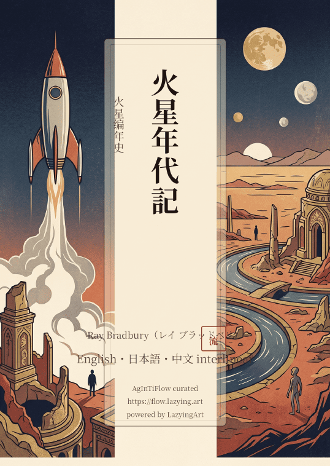 | `martian-chronicles` | English main · 日本語 · 中文 | [Read](https://learn.lazying.art/pdf-reader.html?path=docs/pocketpolyglot/books/en-jp-zh/martian-chronicles/en-main-jp-zh/color/The%20Martian%20Chronicles%EF%BC%88%E6%97%A5%E6%96%87%E3%83%BB%E4%B8%AD%E6%96%87%E6%B3%A8%EF%BC%89%E3%83%BB%E6%9C%80%E5%A4%A7%E8%AA%9E%E7%A8%AE%E3%83%BB%E5%A4%A7%E5%AD%97%E7%89%88.pdf&title=The%20Martian%20Chronicles%EF%BC%88%E6%97%A5%E6%96%87%E3%83%BB%E4%B8%AD%E6%96%87%E6%B3%A8%EF%BC%89) | [Read](https://learn.lazying.art/pdf-reader.html?path=docs/pocketpolyglot/books/en-jp-zh/martian-chronicles/en-main-jp-zh/blackwhite/The%20Martian%20Chronicles%EF%BC%88%E6%97%A5%E6%96%87%E3%83%BB%E4%B8%AD%E6%96%87%E6%B3%A8%E3%83%BB%E9%BB%91%E7%99%BD%EF%BC%89%E3%83%BB%E6%9C%80%E5%A4%A7%E8%AA%9E%E7%A8%AE%E3%83%BB%E5%A4%A7%E5%AD%97%E7%89%88.pdf&title=The%20Martian%20Chronicles%EF%BC%88%E6%97%A5%E6%96%87%E3%83%BB%E4%B8%AD%E6%96%87%E6%B3%A8%EF%BC%89%20black-white) |
|  | `no-longer-human` | English main · 日本語 · 中文 | [Read](https://learn.lazying.art/pdf-reader.html?path=docs/pocketpolyglot/books/en-jp-zh/no-longer-human/en-main-jp-zh/color/No%20Longer%20Human%EF%BC%88%E6%97%A5%E6%96%87%E3%83%BB%E4%B8%AD%E6%96%87%E6%B3%A8%EF%BC%89%E3%83%BB%E6%9C%80%E5%A4%A7%E8%AA%9E%E7%A8%AE%E3%83%BB%E5%A4%A7%E5%AD%97%E7%89%88.pdf&title=No%20Longer%20Human%EF%BC%88%E6%97%A5%E6%96%87%E3%83%BB%E4%B8%AD%E6%96%87%E6%B3%A8%EF%BC%89) | [Read](https://learn.lazying.art/pdf-reader.html?path=docs/pocketpolyglot/books/en-jp-zh/no-longer-human/en-main-jp-zh/blackwhite/No%20Longer%20Human%EF%BC%88%E6%97%A5%E6%96%87%E3%83%BB%E4%B8%AD%E6%96%87%E6%B3%A8%E3%83%BB%E9%BB%91%E7%99%BD%EF%BC%89%E3%83%BB%E6%9C%80%E5%A4%A7%E8%AA%9E%E7%A8%AE%E3%83%BB%E5%A4%A7%E5%AD%97%E7%89%88.pdf&title=No%20Longer%20Human%EF%BC%88%E6%97%A5%E6%96%87%E3%83%BB%E4%B8%AD%E6%96%87%E6%B3%A8%EF%BC%89%20black-white) |
|  | `notre-dame-de-paris` | English main · 日本語 · 中文 | [Read](https://learn.lazying.art/pdf-reader.html?path=docs/pocketpolyglot/books/en-jp-zh/notre-dame-de-paris/en-main-jp-zh/color/Notre-Dame%20de%20Paris%EF%BC%88%E6%97%A5%E6%96%87%E3%83%BB%E4%B8%AD%E6%96%87%E6%B3%A8%EF%BC%89%E3%83%BB%E6%9C%80%E5%A4%A7%E8%AA%9E%E7%A8%AE%E3%83%BB%E5%A4%A7%E5%AD%97%E7%89%88.pdf&title=Notre-Dame%20de%20Paris%EF%BC%88%E6%97%A5%E6%96%87%E3%83%BB%E4%B8%AD%E6%96%87%E6%B3%A8%EF%BC%89) | [Read](https://learn.lazying.art/pdf-reader.html?path=docs/pocketpolyglot/books/en-jp-zh/notre-dame-de-paris/en-main-jp-zh/blackwhite/Notre-Dame%20de%20Paris%EF%BC%88%E6%97%A5%E6%96%87%E3%83%BB%E4%B8%AD%E6%96%87%E6%B3%A8%E3%83%BB%E9%BB%91%E7%99%BD%EF%BC%89%E3%83%BB%E6%9C%80%E5%A4%A7%E8%AA%9E%E7%A8%AE%E3%83%BB%E5%A4%A7%E5%AD%97%E7%89%88.pdf&title=Notre-Dame%20de%20Paris%EF%BC%88%E6%97%A5%E6%96%87%E3%83%BB%E4%B8%AD%E6%96%87%E6%B3%A8%EF%BC%89%20black-white) |
| 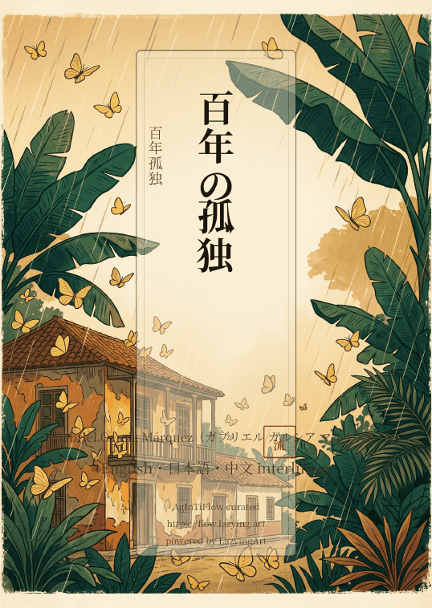 | `one-hundred-years-of-solitude` | English main · 日本語 · 中文 | [Read](https://learn.lazying.art/pdf-reader.html?path=docs/pocketpolyglot/books/en-jp-zh/one-hundred-years-of-solitude/en-main-jp-zh/color/One%20Hundred%20Years%20of%20Solitude%EF%BC%88%E6%97%A5%E6%96%87%E3%83%BB%E4%B8%AD%E6%96%87%E6%B3%A8%EF%BC%89%E3%83%BB%E6%9C%80%E5%A4%A7%E8%AA%9E%E7%A8%AE%E3%83%BB%E5%A4%A7%E5%AD%97%E7%89%88.pdf&title=One%20Hundred%20Years%20of%20Solitude%EF%BC%88%E6%97%A5%E6%96%87%E3%83%BB%E4%B8%AD%E6%96%87%E6%B3%A8%EF%BC%89) | [Read](https://learn.lazying.art/pdf-reader.html?path=docs/pocketpolyglot/books/en-jp-zh/one-hundred-years-of-solitude/en-main-jp-zh/blackwhite/One%20Hundred%20Years%20of%20Solitude%EF%BC%88%E6%97%A5%E6%96%87%E3%83%BB%E4%B8%AD%E6%96%87%E6%B3%A8%E3%83%BB%E9%BB%91%E7%99%BD%EF%BC%89%E3%83%BB%E6%9C%80%E5%A4%A7%E8%AA%9E%E7%A8%AE%E3%83%BB%E5%A4%A7%E5%AD%97%E7%89%88.pdf&title=One%20Hundred%20Years%20of%20Solitude%EF%BC%88%E6%97%A5%E6%96%87%E3%83%BB%E4%B8%AD%E6%96%87%E6%B3%A8%EF%BC%89%20black-white) |
| 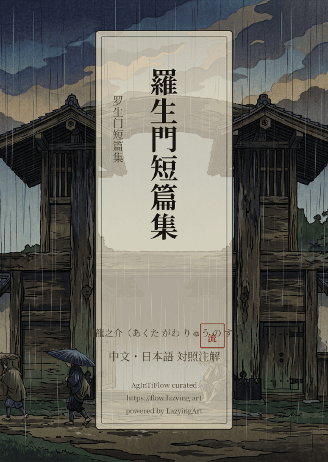 | `rashomon-stories` | English main · 日本語 · 中文 | [Read](https://learn.lazying.art/pdf-reader.html?path=docs/pocketpolyglot/books/en-jp-zh/rashomon-stories/en-main-jp-zh/color/Rashomon%20Stories%EF%BC%88%E6%97%A5%E6%96%87%E3%83%BB%E4%B8%AD%E6%96%87%E6%B3%A8%EF%BC%89%E3%83%BB%E6%9C%80%E5%A4%A7%E8%AA%9E%E7%A8%AE%E3%83%BB%E5%A4%A7%E5%AD%97%E7%89%88.pdf&title=Rashomon%20Stories%EF%BC%88%E6%97%A5%E6%96%87%E3%83%BB%E4%B8%AD%E6%96%87%E6%B3%A8%EF%BC%89) | [Read](https://learn.lazying.art/pdf-reader.html?path=docs/pocketpolyglot/books/en-jp-zh/rashomon-stories/en-main-jp-zh/blackwhite/Rashomon%20Stories%EF%BC%88%E6%97%A5%E6%96%87%E3%83%BB%E4%B8%AD%E6%96%87%E6%B3%A8%E3%83%BB%E9%BB%91%E7%99%BD%EF%BC%89%E3%83%BB%E6%9C%80%E5%A4%A7%E8%AA%9E%E7%A8%AE%E3%83%BB%E5%A4%A7%E5%AD%97%E7%89%88.pdf&title=Rashomon%20Stories%EF%BC%88%E6%97%A5%E6%96%87%E3%83%BB%E4%B8%AD%E6%96%87%E6%B3%A8%EF%BC%89%20black-white) |
| 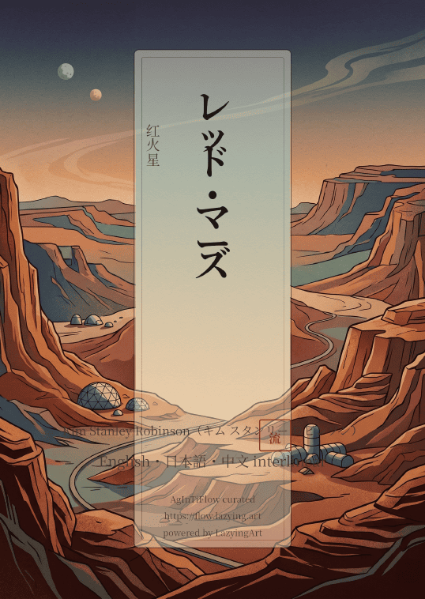 | `red-mars` | English main · 日本語 · 中文 | [Read](https://learn.lazying.art/pdf-reader.html?path=docs/pocketpolyglot/books/en-jp-zh/red-mars/en-main-jp-zh/color/Red%20Mars%EF%BC%88%E6%97%A5%E6%96%87%E3%83%BB%E4%B8%AD%E6%96%87%E6%B3%A8%EF%BC%89%E3%83%BB%E6%9C%80%E5%A4%A7%E8%AA%9E%E7%A8%AE%E3%83%BB%E5%A4%A7%E5%AD%97%E7%89%88.pdf&title=Red%20Mars%EF%BC%88%E6%97%A5%E6%96%87%E3%83%BB%E4%B8%AD%E6%96%87%E6%B3%A8%EF%BC%89) | [Read](https://learn.lazying.art/pdf-reader.html?path=docs/pocketpolyglot/books/en-jp-zh/red-mars/en-main-jp-zh/blackwhite/Red%20Mars%EF%BC%88%E6%97%A5%E6%96%87%E3%83%BB%E4%B8%AD%E6%96%87%E6%B3%A8%E3%83%BB%E9%BB%91%E7%99%BD%EF%BC%89%E3%83%BB%E6%9C%80%E5%A4%A7%E8%AA%9E%E7%A8%AE%E3%83%BB%E5%A4%A7%E5%AD%97%E7%89%88.pdf&title=Red%20Mars%EF%BC%88%E6%97%A5%E6%96%87%E3%83%BB%E4%B8%AD%E6%96%87%E6%B3%A8%EF%BC%89%20black-white) |
| 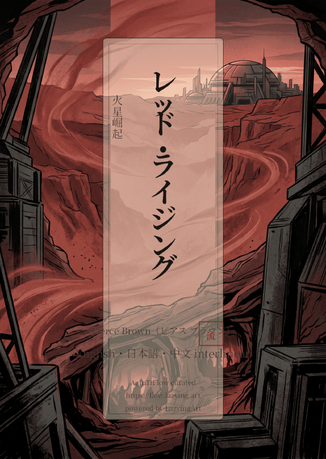 | `red-rising-1` | English main · 日本語 · 中文 | [Read](https://learn.lazying.art/pdf-reader.html?path=docs/pocketpolyglot/books/en-jp-zh/red-rising-1/en-main-jp-zh/color/Red%20Rising%EF%BC%88%E6%97%A5%E6%96%87%E3%83%BB%E4%B8%AD%E6%96%87%E6%B3%A8%EF%BC%89%E3%83%BB%E6%9C%80%E5%A4%A7%E8%AA%9E%E7%A8%AE%E3%83%BB%E5%A4%A7%E5%AD%97%E7%89%88.pdf&title=Red%20Rising%EF%BC%88%E6%97%A5%E6%96%87%E3%83%BB%E4%B8%AD%E6%96%87%E6%B3%A8%EF%BC%89) | [Read](https://learn.lazying.art/pdf-reader.html?path=docs/pocketpolyglot/books/en-jp-zh/red-rising-1/en-main-jp-zh/blackwhite/Red%20Rising%EF%BC%88%E6%97%A5%E6%96%87%E3%83%BB%E4%B8%AD%E6%96%87%E6%B3%A8%E3%83%BB%E9%BB%91%E7%99%BD%EF%BC%89%E3%83%BB%E6%9C%80%E5%A4%A7%E8%AA%9E%E7%A8%AE%E3%83%BB%E5%A4%A7%E5%AD%97%E7%89%88.pdf&title=Red%20Rising%EF%BC%88%E6%97%A5%E6%96%87%E3%83%BB%E4%B8%AD%E6%96%87%E6%B3%A8%EF%BC%89%20black-white) |
| 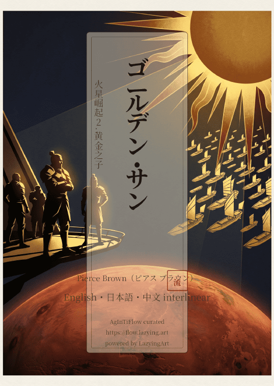 | `red-rising-2` | English main · 日本語 · 中文 | [Read](https://learn.lazying.art/pdf-reader.html?path=docs/pocketpolyglot/books/en-jp-zh/red-rising-2/en-main-jp-zh/color/Golden%20Son%EF%BC%88%E6%97%A5%E6%96%87%E3%83%BB%E4%B8%AD%E6%96%87%E6%B3%A8%EF%BC%89%E3%83%BB%E6%9C%80%E5%A4%A7%E8%AA%9E%E7%A8%AE%E3%83%BB%E5%A4%A7%E5%AD%97%E7%89%88.pdf&title=Golden%20Son%EF%BC%88%E6%97%A5%E6%96%87%E3%83%BB%E4%B8%AD%E6%96%87%E6%B3%A8%EF%BC%89) | [Read](https://learn.lazying.art/pdf-reader.html?path=docs/pocketpolyglot/books/en-jp-zh/red-rising-2/en-main-jp-zh/blackwhite/Golden%20Son%EF%BC%88%E6%97%A5%E6%96%87%E3%83%BB%E4%B8%AD%E6%96%87%E6%B3%A8%E3%83%BB%E9%BB%91%E7%99%BD%EF%BC%89%E3%83%BB%E6%9C%80%E5%A4%A7%E8%AA%9E%E7%A8%AE%E3%83%BB%E5%A4%A7%E5%AD%97%E7%89%88.pdf&title=Golden%20Son%EF%BC%88%E6%97%A5%E6%96%87%E3%83%BB%E4%B8%AD%E6%96%87%E6%B3%A8%EF%BC%89%20black-white) |
|  | `red-rising-3` | English main · 日本語 · 中文 | [Read](https://learn.lazying.art/pdf-reader.html?path=docs/pocketpolyglot/books/en-jp-zh/red-rising-3/en-main-jp-zh/color/Morning%20Star%EF%BC%88%E6%97%A5%E6%96%87%E3%83%BB%E4%B8%AD%E6%96%87%E6%B3%A8%EF%BC%89%E3%83%BB%E6%9C%80%E5%A4%A7%E8%AA%9E%E7%A8%AE%E3%83%BB%E5%A4%A7%E5%AD%97%E7%89%88.pdf&title=Morning%20Star%EF%BC%88%E6%97%A5%E6%96%87%E3%83%BB%E4%B8%AD%E6%96%87%E6%B3%A8%EF%BC%89) | [Read](https://learn.lazying.art/pdf-reader.html?path=docs/pocketpolyglot/books/en-jp-zh/red-rising-3/en-main-jp-zh/blackwhite/Morning%20Star%EF%BC%88%E6%97%A5%E6%96%87%E3%83%BB%E4%B8%AD%E6%96%87%E6%B3%A8%E3%83%BB%E9%BB%91%E7%99%BD%EF%BC%89%E3%83%BB%E6%9C%80%E5%A4%A7%E8%AA%9E%E7%A8%AE%E3%83%BB%E5%A4%A7%E5%AD%97%E7%89%88.pdf&title=Morning%20Star%EF%BC%88%E6%97%A5%E6%96%87%E3%83%BB%E4%B8%AD%E6%96%87%E6%B3%A8%EF%BC%89%20black-white) |
|  | `snow-country` | English main · 日本語 · 中文 | [Read](https://learn.lazying.art/pdf-reader.html?path=docs/pocketpolyglot/books/en-jp-zh/snow-country/en-main-jp-zh/color/Snow%20Country%EF%BC%88%E6%97%A5%E6%96%87%E3%83%BB%E4%B8%AD%E6%96%87%E6%B3%A8%EF%BC%89%E3%83%BB%E6%9C%80%E5%A4%A7%E8%AA%9E%E7%A8%AE%E3%83%BB%E5%A4%A7%E5%AD%97%E7%89%88.pdf&title=Snow%20Country%EF%BC%88%E6%97%A5%E6%96%87%E3%83%BB%E4%B8%AD%E6%96%87%E6%B3%A8%EF%BC%89) | [Read](https://learn.lazying.art/pdf-reader.html?path=docs/pocketpolyglot/books/en-jp-zh/snow-country/en-main-jp-zh/blackwhite/Snow%20Country%EF%BC%88%E6%97%A5%E6%96%87%E3%83%BB%E4%B8%AD%E6%96%87%E6%B3%A8%E3%83%BB%E9%BB%91%E7%99%BD%EF%BC%89%E3%83%BB%E6%9C%80%E5%A4%A7%E8%AA%9E%E7%A8%AE%E3%83%BB%E5%A4%A7%E5%AD%97%E7%89%88.pdf&title=Snow%20Country%EF%BC%88%E6%97%A5%E6%96%87%E3%83%BB%E4%B8%AD%E6%96%87%E6%B3%A8%EF%BC%89%20black-white) |
|  | `spring-snow` | English main · 日本語 · 中文 | [Read](https://learn.lazying.art/pdf-reader.html?path=docs/pocketpolyglot/books/en-jp-zh/spring-snow/en-main-jp-zh/color/Spring%20Snow%EF%BC%88%E6%97%A5%E6%96%87%E3%83%BB%E4%B8%AD%E6%96%87%E6%B3%A8%EF%BC%89%E3%83%BB%E6%9C%80%E5%A4%A7%E8%AA%9E%E7%A8%AE%E3%83%BB%E5%A4%A7%E5%AD%97%E7%89%88.pdf&title=Spring%20Snow%EF%BC%88%E6%97%A5%E6%96%87%E3%83%BB%E4%B8%AD%E6%96%87%E6%B3%A8%EF%BC%89) | [Read](https://learn.lazying.art/pdf-reader.html?path=docs/pocketpolyglot/books/en-jp-zh/spring-snow/en-main-jp-zh/blackwhite/Spring%20Snow%EF%BC%88%E6%97%A5%E6%96%87%E3%83%BB%E4%B8%AD%E6%96%87%E6%B3%A8%E3%83%BB%E9%BB%91%E7%99%BD%EF%BC%89%E3%83%BB%E6%9C%80%E5%A4%A7%E8%AA%9E%E7%A8%AE%E3%83%BB%E5%A4%A7%E5%AD%97%E7%89%88.pdf&title=Spring%20Snow%EF%BC%88%E6%97%A5%E6%96%87%E3%83%BB%E4%B8%AD%E6%96%87%E6%B3%A8%EF%BC%89%20black-white) |
|  | `the-count-of-monte-cristo` | English main · 日本語 · 中文 | [Read](https://learn.lazying.art/pdf-reader.html?path=docs/pocketpolyglot/books/en-jp-zh/the-count-of-monte-cristo/en-main-jp-zh/color/The%20Count%20of%20Monte%20Cristo%EF%BC%88%E6%97%A5%E6%96%87%E3%83%BB%E4%B8%AD%E6%96%87%E6%B3%A8%EF%BC%89%E3%83%BB%E6%9C%80%E5%A4%A7%E8%AA%9E%E7%A8%AE%E3%83%BB%E5%A4%A7%E5%AD%97%E7%89%88.pdf&title=The%20Count%20of%20Monte%20Cristo%EF%BC%88%E6%97%A5%E6%96%87%E3%83%BB%E4%B8%AD%E6%96%87%E6%B3%A8%EF%BC%89) | [Read](https://learn.lazying.art/pdf-reader.html?path=docs/pocketpolyglot/books/en-jp-zh/the-count-of-monte-cristo/en-main-jp-zh/blackwhite/The%20Count%20of%20Monte%20Cristo%EF%BC%88%E6%97%A5%E6%96%87%E3%83%BB%E4%B8%AD%E6%96%87%E6%B3%A8%E3%83%BB%E9%BB%91%E7%99%BD%EF%BC%89%E3%83%BB%E6%9C%80%E5%A4%A7%E8%AA%9E%E7%A8%AE%E3%83%BB%E5%A4%A7%E5%AD%97%E7%89%88.pdf&title=The%20Count%20of%20Monte%20Cristo%EF%BC%88%E6%97%A5%E6%96%87%E3%83%BB%E4%B8%AD%E6%96%87%E6%B3%A8%EF%BC%89%20black-white) |
|  | `the-martian` | English main · 日本語 · 中文 | [Read](https://learn.lazying.art/pdf-reader.html?path=docs/pocketpolyglot/books/en-jp-zh/the-martian/en-main-jp-zh/color/The%20Martian%EF%BC%88%E6%97%A5%E6%96%87%E3%83%BB%E4%B8%AD%E6%96%87%E6%B3%A8%EF%BC%89%E3%83%BB%E6%9C%80%E5%A4%A7%E8%AA%9E%E7%A8%AE%E3%83%BB%E5%A4%A7%E5%AD%97%E7%89%88.pdf&title=The%20Martian%EF%BC%88%E6%97%A5%E6%96%87%E3%83%BB%E4%B8%AD%E6%96%87%E6%B3%A8%EF%BC%89) | [Read](https://learn.lazying.art/pdf-reader.html?path=docs/pocketpolyglot/books/en-jp-zh/the-martian/en-main-jp-zh/blackwhite/The%20Martian%EF%BC%88%E6%97%A5%E6%96%87%E3%83%BB%E4%B8%AD%E6%96%87%E6%B3%A8%E3%83%BB%E9%BB%91%E7%99%BD%EF%BC%89%E3%83%BB%E6%9C%80%E5%A4%A7%E8%AA%9E%E7%A8%AE%E3%83%BB%E5%A4%A7%E5%AD%97%E7%89%88.pdf&title=The%20Martian%EF%BC%88%E6%97%A5%E6%96%87%E3%83%BB%E4%B8%AD%E6%96%87%E6%B3%A8%EF%BC%89%20black-white) |
| 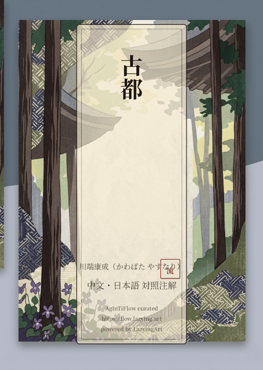 | `the-old-capital` | English main · 日本語 · 中文 | [Read](https://learn.lazying.art/pdf-reader.html?path=docs/pocketpolyglot/books/en-jp-zh/the-old-capital/en-main-jp-zh/color/The%20Old%20Capital%EF%BC%88%E6%97%A5%E6%96%87%E3%83%BB%E4%B8%AD%E6%96%87%E6%B3%A8%EF%BC%89%E3%83%BB%E6%9C%80%E5%A4%A7%E8%AA%9E%E7%A8%AE%E3%83%BB%E5%A4%A7%E5%AD%97%E7%89%88.pdf&title=The%20Old%20Capital%EF%BC%88%E6%97%A5%E6%96%87%E3%83%BB%E4%B8%AD%E6%96%87%E6%B3%A8%EF%BC%89) | [Read](https://learn.lazying.art/pdf-reader.html?path=docs/pocketpolyglot/books/en-jp-zh/the-old-capital/en-main-jp-zh/blackwhite/The%20Old%20Capital%EF%BC%88%E6%97%A5%E6%96%87%E3%83%BB%E4%B8%AD%E6%96%87%E6%B3%A8%E3%83%BB%E9%BB%91%E7%99%BD%EF%BC%89%E3%83%BB%E6%9C%80%E5%A4%A7%E8%AA%9E%E7%A8%AE%E3%83%BB%E5%A4%A7%E5%AD%97%E7%89%88.pdf&title=The%20Old%20Capital%EF%BC%88%E6%97%A5%E6%96%87%E3%83%BB%E4%B8%AD%E6%96%87%E6%B3%A8%EF%BC%89%20black-white) |
|  | `the-sirens-of-mars` | English main · 日本語 · 中文 | [Read](https://learn.lazying.art/pdf-reader.html?path=docs/pocketpolyglot/books/en-jp-zh/the-sirens-of-mars/en-main-jp-zh/color/The%20Sirens%20of%20Mars%EF%BC%88%E6%97%A5%E6%96%87%E3%83%BB%E4%B8%AD%E6%96%87%E6%B3%A8%EF%BC%89%E3%83%BB%E6%9C%80%E5%A4%A7%E8%AA%9E%E7%A8%AE%E3%83%BB%E5%A4%A7%E5%AD%97%E7%89%88.pdf&title=The%20Sirens%20of%20Mars%EF%BC%88%E6%97%A5%E6%96%87%E3%83%BB%E4%B8%AD%E6%96%87%E6%B3%A8%EF%BC%89) | [Read](https://learn.lazying.art/pdf-reader.html?path=docs/pocketpolyglot/books/en-jp-zh/the-sirens-of-mars/en-main-jp-zh/blackwhite/The%20Sirens%20of%20Mars%EF%BC%88%E6%97%A5%E6%96%87%E3%83%BB%E4%B8%AD%E6%96%87%E6%B3%A8%E3%83%BB%E9%BB%91%E7%99%BD%EF%BC%89%E3%83%BB%E6%9C%80%E5%A4%A7%E8%AA%9E%E7%A8%AE%E3%83%BB%E5%A4%A7%E5%AD%97%E7%89%88.pdf&title=The%20Sirens%20of%20Mars%EF%BC%88%E6%97%A5%E6%96%87%E3%83%BB%E4%B8%AD%E6%96%87%E6%B3%A8%EF%BC%89%20black-white) |
|  | `woman-in-the-dunes` | English main · 日本語 · 中文 | [Read](https://learn.lazying.art/pdf-reader.html?path=docs/pocketpolyglot/books/en-jp-zh/woman-in-the-dunes/en-main-jp-zh/color/The%20Woman%20in%20the%20Dunes%EF%BC%88%E6%97%A5%E6%96%87%E3%83%BB%E4%B8%AD%E6%96%87%E6%B3%A8%EF%BC%89%E3%83%BB%E6%9C%80%E5%A4%A7%E8%AA%9E%E7%A8%AE%E3%83%BB%E5%A4%A7%E5%AD%97%E7%89%88.pdf&title=The%20Woman%20in%20the%20Dunes%EF%BC%88%E6%97%A5%E6%96%87%E3%83%BB%E4%B8%AD%E6%96%87%E6%B3%A8%EF%BC%89) | [Read](https://learn.lazying.art/pdf-reader.html?path=docs/pocketpolyglot/books/en-jp-zh/woman-in-the-dunes/en-main-jp-zh/blackwhite/The%20Woman%20in%20the%20Dunes%EF%BC%88%E6%97%A5%E6%96%87%E3%83%BB%E4%B8%AD%E6%96%87%E6%B3%A8%E3%83%BB%E9%BB%91%E7%99%BD%EF%BC%89%E3%83%BB%E6%9C%80%E5%A4%A7%E8%AA%9E%E7%A8%AE%E3%83%BB%E5%A4%A7%E5%AD%97%E7%89%88.pdf&title=The%20Woman%20in%20the%20Dunes%EF%BC%88%E6%97%A5%E6%96%87%E3%83%BB%E4%B8%AD%E6%96%87%E6%B3%A8%EF%BC%89%20black-white) |
|  | `wuthering-heights` | English main · 日本語 · 中文 | [Read](https://learn.lazying.art/pdf-reader.html?path=docs/pocketpolyglot/books/en-jp-zh/wuthering-heights/en-main-jp-zh/color/Wuthering%20Heights%EF%BC%88%E6%97%A5%E6%96%87%E3%83%BB%E4%B8%AD%E6%96%87%E6%B3%A8%EF%BC%89%E3%83%BB%E6%9C%80%E5%A4%A7%E8%AA%9E%E7%A8%AE%E3%83%BB%E5%A4%A7%E5%AD%97%E7%89%88.pdf&title=Wuthering%20Heights%EF%BC%88%E6%97%A5%E6%96%87%E3%83%BB%E4%B8%AD%E6%96%87%E6%B3%A8%EF%BC%89) | [Read](https://learn.lazying.art/pdf-reader.html?path=docs/pocketpolyglot/books/en-jp-zh/wuthering-heights/en-main-jp-zh/blackwhite/Wuthering%20Heights%EF%BC%88%E6%97%A5%E6%96%87%E3%83%BB%E4%B8%AD%E6%96%87%E6%B3%A8%E3%83%BB%E9%BB%91%E7%99%BD%EF%BC%89%E3%83%BB%E6%9C%80%E5%A4%A7%E8%AA%9E%E7%A8%AE%E3%83%BB%E5%A4%A7%E5%AD%97%E7%89%88.pdf&title=Wuthering%20Heights%EF%BC%88%E6%97%A5%E6%96%87%E3%83%BB%E4%B8%AD%E6%96%87%E6%B3%A8%EF%BC%89%20black-white) |
|  | `chumon-no-ooi-ryoriten` | 日本語 main · 中文 | [Read](https://learn.lazying.art/pdf-reader.html?path=docs/pocketpolyglot/books/jp-zh/chumon-no-ooi-ryoriten/jp-main/color/%E6%B3%A8%E6%96%87%E3%81%AE%E5%A4%9A%E3%81%84%E6%96%99%E7%90%86%E5%BA%97%EF%BC%88%E4%B8%AD%E6%96%87%E6%B3%A8%EF%BC%89%E3%83%BB%E6%9C%80%E5%A4%A7%E8%AA%9E%E7%A8%AE%E3%83%BB%E5%A4%A7%E5%AD%97%E7%89%88.pdf&title=%E6%B3%A8%E6%96%87%E3%81%AE%E5%A4%9A%E3%81%84%E6%96%99%E7%90%86%E5%BA%97%EF%BC%88%E4%B8%AD%E6%96%87%E6%B3%A8%EF%BC%89) | [Read](https://learn.lazying.art/pdf-reader.html?path=docs/pocketpolyglot/books/jp-zh/chumon-no-ooi-ryoriten/jp-main/blackwhite/%E6%B3%A8%E6%96%87%E3%81%AE%E5%A4%9A%E3%81%84%E6%96%99%E7%90%86%E5%BA%97%EF%BC%88%E4%B8%AD%E6%96%87%E6%B3%A8%E3%83%BB%E9%BB%91%E7%99%BD%EF%BC%89%E3%83%BB%E6%9C%80%E5%A4%A7%E8%AA%9E%E7%A8%AE%E3%83%BB%E5%A4%A7%E5%AD%97%E7%89%88.pdf&title=%E6%B3%A8%E6%96%87%E3%81%AE%E5%A4%9A%E3%81%84%E6%96%99%E7%90%86%E5%BA%97%EF%BC%88%E4%B8%AD%E6%96%87%E6%B3%A8%EF%BC%89%20black-white) |
|  | `chumon-no-ooi-ryoriten` | 中文 main · 日本語 | [Read](https://learn.lazying.art/pdf-reader.html?path=docs/pocketpolyglot/books/jp-zh/chumon-no-ooi-ryoriten/zh-main/color/%E8%A6%81%E6%B1%82%E5%A4%AA%E5%A4%9A%E7%9A%84%E9%A4%90%E9%A6%86%EF%BC%88%E6%97%A5%E6%96%87%E6%B3%A8%EF%BC%89%E3%83%BB%E6%9C%80%E5%A4%A7%E8%AA%9E%E7%A8%AE%E3%83%BB%E5%A4%A7%E5%AD%97%E7%89%88.pdf&title=%E8%A6%81%E6%B1%82%E5%A4%AA%E5%A4%9A%E7%9A%84%E9%A4%90%E9%A6%86%EF%BC%88%E6%97%A5%E6%96%87%E6%B3%A8%EF%BC%89) | [Read](https://learn.lazying.art/pdf-reader.html?path=docs/pocketpolyglot/books/jp-zh/chumon-no-ooi-ryoriten/zh-main/blackwhite/%E8%A6%81%E6%B1%82%E5%A4%AA%E5%A4%9A%E7%9A%84%E9%A4%90%E9%A6%86%EF%BC%88%E6%97%A5%E6%96%87%E6%B3%A8%E3%83%BB%E9%BB%91%E7%99%BD%EF%BC%89%E3%83%BB%E6%9C%80%E5%A4%A7%E8%AA%9E%E7%A8%AE%E3%83%BB%E5%A4%A7%E5%AD%97%E7%89%88.pdf&title=%E8%A6%81%E6%B1%82%E5%A4%AA%E5%A4%9A%E7%9A%84%E9%A4%90%E9%A6%86%EF%BC%88%E6%97%A5%E6%96%87%E6%B3%A8%EF%BC%89%20black-white) |
|  | `ginga-tetsudo` | 日本語 main · 中文 | [Read](https://learn.lazying.art/pdf-reader.html?path=docs/pocketpolyglot/books/jp-zh/ginga-tetsudo/jp-main/color/%E9%8A%80%E6%B2%B3%E9%89%84%E9%81%93%E3%81%AE%E5%A4%9C%EF%BC%88%E4%B8%AD%E6%96%87%E6%B3%A8%EF%BC%89%E3%83%BB%E6%9C%80%E5%A4%A7%E8%AA%9E%E7%A8%AE%E3%83%BB%E5%A4%A7%E5%AD%97%E7%89%88.pdf&title=%E9%8A%80%E6%B2%B3%E9%89%84%E9%81%93%E3%81%AE%E5%A4%9C%EF%BC%88%E4%B8%AD%E6%96%87%E6%B3%A8%EF%BC%89) | [Read](https://learn.lazying.art/pdf-reader.html?path=docs/pocketpolyglot/books/jp-zh/ginga-tetsudo/jp-main/blackwhite/%E9%8A%80%E6%B2%B3%E9%89%84%E9%81%93%E3%81%AE%E5%A4%9C%EF%BC%88%E4%B8%AD%E6%96%87%E6%B3%A8%E3%83%BB%E9%BB%91%E7%99%BD%EF%BC%89%E3%83%BB%E6%9C%80%E5%A4%A7%E8%AA%9E%E7%A8%AE%E3%83%BB%E5%A4%A7%E5%AD%97%E7%89%88.pdf&title=%E9%8A%80%E6%B2%B3%E9%89%84%E9%81%93%E3%81%AE%E5%A4%9C%EF%BC%88%E4%B8%AD%E6%96%87%E6%B3%A8%EF%BC%89%20black-white) |
|  | `ginga-tetsudo` | 中文 main · 日本語 | [Read](https://learn.lazying.art/pdf-reader.html?path=docs/pocketpolyglot/books/jp-zh/ginga-tetsudo/zh-main/color/%E9%93%B6%E6%B2%B3%E9%93%81%E9%81%93%E4%B9%8B%E5%A4%9C%EF%BC%88%E6%97%A5%E6%96%87%E6%B3%A8%EF%BC%89%E3%83%BB%E6%9C%80%E5%A4%A7%E8%AA%9E%E7%A8%AE%E3%83%BB%E5%A4%A7%E5%AD%97%E7%89%88.pdf&title=%E9%93%B6%E6%B2%B3%E9%93%81%E9%81%93%E4%B9%8B%E5%A4%9C%EF%BC%88%E6%97%A5%E6%96%87%E6%B3%A8%EF%BC%89) | [Read](https://learn.lazying.art/pdf-reader.html?path=docs/pocketpolyglot/books/jp-zh/ginga-tetsudo/zh-main/blackwhite/%E9%93%B6%E6%B2%B3%E9%93%81%E9%81%93%E4%B9%8B%E5%A4%9C%EF%BC%88%E6%97%A5%E6%96%87%E6%B3%A8%E3%83%BB%E9%BB%91%E7%99%BD%EF%BC%89%E3%83%BB%E6%9C%80%E5%A4%A7%E8%AA%9E%E7%A8%AE%E3%83%BB%E5%A4%A7%E5%AD%97%E7%89%88.pdf&title=%E9%93%B6%E6%B2%B3%E9%93%81%E9%81%93%E4%B9%8B%E5%A4%9C%EF%BC%88%E6%97%A5%E6%96%87%E6%B3%A8%EF%BC%89%20black-white) |
|  | `kojiki` | 日本語 main · 中文 | [Read](https://learn.lazying.art/pdf-reader.html?path=docs/pocketpolyglot/books/jp-zh/kojiki/jp-main/color/%E5%8F%A4%E4%BA%8B%E8%A8%98%EF%BC%88%E4%B8%AD%E6%96%87%E6%B3%A8%EF%BC%89%E3%83%BB%E6%9C%80%E5%A4%A7%E8%AA%9E%E7%A8%AE%E3%83%BB%E5%A4%A7%E5%AD%97%E7%89%88.pdf&title=%E5%8F%A4%E4%BA%8B%E8%A8%98%EF%BC%88%E4%B8%AD%E6%96%87%E6%B3%A8%EF%BC%89) | [Read](https://learn.lazying.art/pdf-reader.html?path=docs/pocketpolyglot/books/jp-zh/kojiki/jp-main/blackwhite/%E5%8F%A4%E4%BA%8B%E8%A8%98%EF%BC%88%E4%B8%AD%E6%96%87%E6%B3%A8%E3%83%BB%E9%BB%91%E7%99%BD%EF%BC%89%E3%83%BB%E6%9C%80%E5%A4%A7%E8%AA%9E%E7%A8%AE%E3%83%BB%E5%A4%A7%E5%AD%97%E7%89%88.pdf&title=%E5%8F%A4%E4%BA%8B%E8%A8%98%EF%BC%88%E4%B8%AD%E6%96%87%E6%B3%A8%EF%BC%89%20black-white) |
|  | `kojiki` | 中文 main · 日本語 | [Read](https://learn.lazying.art/pdf-reader.html?path=docs/pocketpolyglot/books/jp-zh/kojiki/zh-main/color/%E5%8F%A4%E4%BA%8B%E8%A8%98%EF%BC%88%E6%97%A5%E6%96%87%E6%B3%A8%EF%BC%89%E3%83%BB%E6%9C%80%E5%A4%A7%E8%AA%9E%E7%A8%AE%E3%83%BB%E5%A4%A7%E5%AD%97%E7%89%88.pdf&title=%E5%8F%A4%E4%BA%8B%E8%A8%98%EF%BC%88%E6%97%A5%E6%96%87%E6%B3%A8%EF%BC%89) | [Read](https://learn.lazying.art/pdf-reader.html?path=docs/pocketpolyglot/books/jp-zh/kojiki/zh-main/blackwhite/%E5%8F%A4%E4%BA%8B%E8%A8%98%EF%BC%88%E6%97%A5%E6%96%87%E6%B3%A8%E3%83%BB%E9%BB%91%E7%99%BD%EF%BC%89%E3%83%BB%E6%9C%80%E5%A4%A7%E8%AA%9E%E7%A8%AE%E3%83%BB%E5%A4%A7%E5%AD%97%E7%89%88.pdf&title=%E5%8F%A4%E4%BA%8B%E8%A8%98%EF%BC%88%E6%97%A5%E6%96%87%E6%B3%A8%EF%BC%89%20black-white) |
| 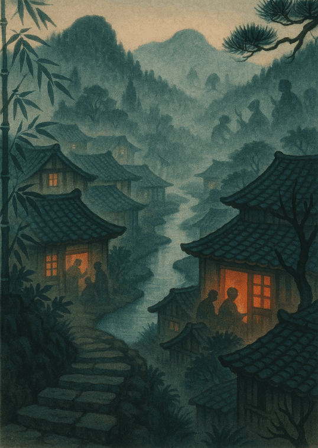 | `sichuan-folk-stories-vol1` | 日本語 main · 中文 | [Read](https://learn.lazying.art/pdf-reader.html?path=docs/pocketpolyglot/books/jp-zh/sichuan-folk-stories-vol1/jp-main/color/%E4%B8%AD%E5%9B%BD%E6%B0%91%E9%96%93%E6%95%85%E4%BA%8B%E9%9B%86%E6%88%90%E5%9B%9B%E5%B7%9D%E5%B7%BB%E4%B8%8A%EF%BC%88%E4%B8%AD%E6%96%87%E6%B3%A8%EF%BC%89%E3%83%BB%E6%9C%80%E5%A4%A7%E8%AA%9E%E7%A8%AE%E3%83%BB%E5%A4%A7%E5%AD%97%E7%89%88.pdf&title=%E4%B8%AD%E5%9B%BD%E6%B0%91%E9%96%93%E6%95%85%E4%BA%8B%E9%9B%86%E6%88%90%E5%9B%9B%E5%B7%9D%E5%B7%BB%E4%B8%8A%EF%BC%88%E4%B8%AD%E6%96%87%E6%B3%A8%EF%BC%89) | [Read](https://learn.lazying.art/pdf-reader.html?path=docs/pocketpolyglot/books/jp-zh/sichuan-folk-stories-vol1/jp-main/blackwhite/%E4%B8%AD%E5%9B%BD%E6%B0%91%E9%96%93%E6%95%85%E4%BA%8B%E9%9B%86%E6%88%90%E5%9B%9B%E5%B7%9D%E5%B7%BB%E4%B8%8A%EF%BC%88%E4%B8%AD%E6%96%87%E6%B3%A8%E3%83%BB%E9%BB%91%E7%99%BD%EF%BC%89%E3%83%BB%E6%9C%80%E5%A4%A7%E8%AA%9E%E7%A8%AE%E3%83%BB%E5%A4%A7%E5%AD%97%E7%89%88.pdf&title=%E4%B8%AD%E5%9B%BD%E6%B0%91%E9%96%93%E6%95%85%E4%BA%8B%E9%9B%86%E6%88%90%E5%9B%9B%E5%B7%9D%E5%B7%BB%E4%B8%8A%EF%BC%88%E4%B8%AD%E6%96%87%E6%B3%A8%EF%BC%89%20black-white) |
|  | `sichuan-folk-stories-vol1` | 中文 main · 日本語 | [Read](https://learn.lazying.art/pdf-reader.html?path=docs/pocketpolyglot/books/jp-zh/sichuan-folk-stories-vol1/zh-main/color/%E4%B8%AD%E5%9B%BD%E6%B0%91%E9%97%B4%E6%95%85%E4%BA%8B%E9%9B%86%E6%88%90%E5%9B%9B%E5%B7%9D%E5%8D%B7%E4%B8%8A%EF%BC%88%E6%97%A5%E6%96%87%E6%B3%A8%EF%BC%89%E3%83%BB%E6%9C%80%E5%A4%A7%E8%AA%9E%E7%A8%AE%E3%83%BB%E5%A4%A7%E5%AD%97%E7%89%88.pdf&title=%E4%B8%AD%E5%9B%BD%E6%B0%91%E9%97%B4%E6%95%85%E4%BA%8B%E9%9B%86%E6%88%90%E5%9B%9B%E5%B7%9D%E5%8D%B7%E4%B8%8A%EF%BC%88%E6%97%A5%E6%96%87%E6%B3%A8%EF%BC%89) | [Read](https://learn.lazying.art/pdf-reader.html?path=docs/pocketpolyglot/books/jp-zh/sichuan-folk-stories-vol1/zh-main/blackwhite/%E4%B8%AD%E5%9B%BD%E6%B0%91%E9%97%B4%E6%95%85%E4%BA%8B%E9%9B%86%E6%88%90%E5%9B%9B%E5%B7%9D%E5%8D%B7%E4%B8%8A%EF%BC%88%E6%97%A5%E6%96%87%E6%B3%A8%E3%83%BB%E9%BB%91%E7%99%BD%EF%BC%89%E3%83%BB%E6%9C%80%E5%A4%A7%E8%AA%9E%E7%A8%AE%E3%83%BB%E5%A4%A7%E5%AD%97%E7%89%88.pdf&title=%E4%B8%AD%E5%9B%BD%E6%B0%91%E9%97%B4%E6%95%85%E4%BA%8B%E9%9B%86%E6%88%90%E5%9B%9B%E5%B7%9D%E5%8D%B7%E4%B8%8A%EF%BC%88%E6%97%A5%E6%96%87%E6%B3%A8%EF%BC%89%20black-white) |
| 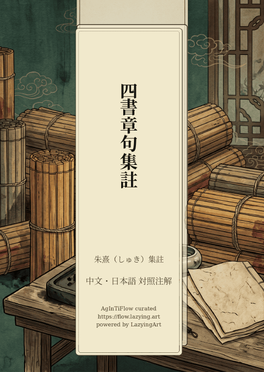 | `sishu-jizhu` | 日本語 main · 中文 | [Read](https://learn.lazying.art/pdf-reader.html?path=docs/pocketpolyglot/books/jp-zh/sishu-jizhu/jp-main/color/%E5%9B%9B%E6%9B%B8%E7%AB%A0%E5%8F%A5%E9%9B%86%E6%B3%A8%EF%BC%88%E4%B8%AD%E6%96%87%E6%B3%A8%EF%BC%89%E3%83%BB%E6%9C%80%E5%A4%A7%E8%AA%9E%E7%A8%AE%E3%83%BB%E5%A4%A7%E5%AD%97%E7%89%88.pdf&title=%E5%9B%9B%E6%9B%B8%E7%AB%A0%E5%8F%A5%E9%9B%86%E6%B3%A8%EF%BC%88%E4%B8%AD%E6%96%87%E6%B3%A8%EF%BC%89) | [Read](https://learn.lazying.art/pdf-reader.html?path=docs/pocketpolyglot/books/jp-zh/sishu-jizhu/jp-main/blackwhite/%E5%9B%9B%E6%9B%B8%E7%AB%A0%E5%8F%A5%E9%9B%86%E6%B3%A8%EF%BC%88%E4%B8%AD%E6%96%87%E6%B3%A8%E3%83%BB%E9%BB%91%E7%99%BD%EF%BC%89%E3%83%BB%E6%9C%80%E5%A4%A7%E8%AA%9E%E7%A8%AE%E3%83%BB%E5%A4%A7%E5%AD%97%E7%89%88.pdf&title=%E5%9B%9B%E6%9B%B8%E7%AB%A0%E5%8F%A5%E9%9B%86%E6%B3%A8%EF%BC%88%E4%B8%AD%E6%96%87%E6%B3%A8%EF%BC%89%20black-white) |
|  | `sishu-jizhu` | 中文 main · 日本語 | [Read](https://learn.lazying.art/pdf-reader.html?path=docs/pocketpolyglot/books/jp-zh/sishu-jizhu/zh-main/color/%E5%9B%9B%E6%9B%B8%E7%AB%A0%E5%8F%A5%E9%9B%86%E8%A8%BB%EF%BC%88%E6%97%A5%E6%96%87%E6%B3%A8%EF%BC%89%E3%83%BB%E6%9C%80%E5%A4%A7%E8%AA%9E%E7%A8%AE%E3%83%BB%E5%A4%A7%E5%AD%97%E7%89%88.pdf&title=%E5%9B%9B%E6%9B%B8%E7%AB%A0%E5%8F%A5%E9%9B%86%E8%A8%BB%EF%BC%88%E6%97%A5%E6%96%87%E6%B3%A8%EF%BC%89) | [Read](https://learn.lazying.art/pdf-reader.html?path=docs/pocketpolyglot/books/jp-zh/sishu-jizhu/zh-main/blackwhite/%E5%9B%9B%E6%9B%B8%E7%AB%A0%E5%8F%A5%E9%9B%86%E8%A8%BB%EF%BC%88%E6%97%A5%E6%96%87%E6%B3%A8%E3%83%BB%E9%BB%91%E7%99%BD%EF%BC%89%E3%83%BB%E6%9C%80%E5%A4%A7%E8%AA%9E%E7%A8%AE%E3%83%BB%E5%A4%A7%E5%AD%97%E7%89%88.pdf&title=%E5%9B%9B%E6%9B%B8%E7%AB%A0%E5%8F%A5%E9%9B%86%E8%A8%BB%EF%BC%88%E6%97%A5%E6%96%87%E6%B3%A8%EF%BC%89%20black-white) |
| 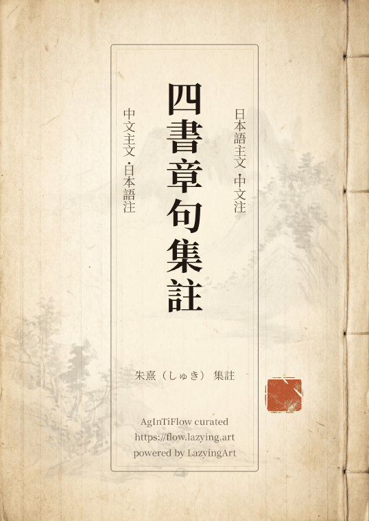 | `sishu-jizhu-aginti` | 日本語 main · 中文 | [Read](https://learn.lazying.art/pdf-reader.html?path=docs/pocketpolyglot/books/jp-zh/sishu-jizhu-aginti/jp-main/color/%E5%9B%9B%E6%9B%B8%E7%AB%A0%E5%8F%A5%E9%9B%86%E6%B3%A8%EF%BC%88%E4%B8%AD%E6%96%87%E6%B3%A8%EF%BC%89%E3%83%BB%E6%9C%80%E5%A4%A7%E8%AA%9E%E7%A8%AE%E3%83%BB%E5%A4%A7%E5%AD%97%E7%89%88.pdf&title=%E5%9B%9B%E6%9B%B8%E7%AB%A0%E5%8F%A5%E9%9B%86%E6%B3%A8%EF%BC%88%E4%B8%AD%E6%96%87%E6%B3%A8%EF%BC%89) | [Read](https://learn.lazying.art/pdf-reader.html?path=docs/pocketpolyglot/books/jp-zh/sishu-jizhu-aginti/jp-main/blackwhite/%E5%9B%9B%E6%9B%B8%E7%AB%A0%E5%8F%A5%E9%9B%86%E6%B3%A8%EF%BC%88%E4%B8%AD%E6%96%87%E6%B3%A8%E3%83%BB%E9%BB%91%E7%99%BD%EF%BC%89%E3%83%BB%E6%9C%80%E5%A4%A7%E8%AA%9E%E7%A8%AE%E3%83%BB%E5%A4%A7%E5%AD%97%E7%89%88.pdf&title=%E5%9B%9B%E6%9B%B8%E7%AB%A0%E5%8F%A5%E9%9B%86%E6%B3%A8%EF%BC%88%E4%B8%AD%E6%96%87%E6%B3%A8%EF%BC%89%20black-white) |
|  | `sishu-jizhu-aginti` | 中文 main · 日本語 | [Read](https://learn.lazying.art/pdf-reader.html?path=docs/pocketpolyglot/books/jp-zh/sishu-jizhu-aginti/zh-main/color/%E5%9B%9B%E6%9B%B8%E7%AB%A0%E5%8F%A5%E9%9B%86%E8%A8%BB%EF%BC%88%E6%97%A5%E6%96%87%E6%B3%A8%EF%BC%89%E3%83%BB%E6%9C%80%E5%A4%A7%E8%AA%9E%E7%A8%AE%E3%83%BB%E5%A4%A7%E5%AD%97%E7%89%88.pdf&title=%E5%9B%9B%E6%9B%B8%E7%AB%A0%E5%8F%A5%E9%9B%86%E8%A8%BB%EF%BC%88%E6%97%A5%E6%96%87%E6%B3%A8%EF%BC%89) | [Read](https://learn.lazying.art/pdf-reader.html?path=docs/pocketpolyglot/books/jp-zh/sishu-jizhu-aginti/zh-main/blackwhite/%E5%9B%9B%E6%9B%B8%E7%AB%A0%E5%8F%A5%E9%9B%86%E8%A8%BB%EF%BC%88%E6%97%A5%E6%96%87%E6%B3%A8%E3%83%BB%E9%BB%91%E7%99%BD%EF%BC%89%E3%83%BB%E6%9C%80%E5%A4%A7%E8%AA%9E%E7%A8%AE%E3%83%BB%E5%A4%A7%E5%AD%97%E7%89%88.pdf&title=%E5%9B%9B%E6%9B%B8%E7%AB%A0%E5%8F%A5%E9%9B%86%E8%A8%BB%EF%BC%88%E6%97%A5%E6%96%87%E6%B3%A8%EF%BC%89%20black-white) |
|  | `kokin-wakashu` | English main · 日本語 · 中文 | [Read](https://learn.lazying.art/pdf-reader.html?path=docs/pocketpolyglot/books/wayakana-en-jp-zh/kokin-wakashu/en-main-jp-zh/color/Kokin%20Wakashu%EF%BC%88%E6%97%A5%E6%96%87%E3%83%BB%E4%B8%AD%E6%96%87%E6%B3%A8%EF%BC%89%E3%83%BB%E6%9C%80%E5%A4%A7%E8%AA%9E%E7%A8%AE%E3%83%BB%E5%A4%A7%E5%AD%97%E7%89%88.pdf&title=Kokin%20Wakashu%EF%BC%88%E6%97%A5%E6%96%87%E3%83%BB%E4%B8%AD%E6%96%87%E6%B3%A8%EF%BC%89) | [Read](https://learn.lazying.art/pdf-reader.html?path=docs/pocketpolyglot/books/wayakana-en-jp-zh/kokin-wakashu/en-main-jp-zh/blackwhite/Kokin%20Wakashu%EF%BC%88%E6%97%A5%E6%96%87%E3%83%BB%E4%B8%AD%E6%96%87%E6%B3%A8%E3%83%BB%E9%BB%91%E7%99%BD%EF%BC%89%E3%83%BB%E6%9C%80%E5%A4%A7%E8%AA%9E%E7%A8%AE%E3%83%BB%E5%A4%A7%E5%AD%97%E7%89%88.pdf&title=Kokin%20Wakashu%EF%BC%88%E6%97%A5%E6%96%87%E3%83%BB%E4%B8%AD%E6%96%87%E6%B3%A8%EF%BC%89%20black-white) |
|  | `kokin-wakashu` | 和歌仮名 main · English · 中文 | [Read](https://learn.lazying.art/pdf-reader.html?path=docs/pocketpolyglot/books/wayakana-en-jp-zh/kokin-wakashu/wayakana-main-en-zh/color/%E5%8F%A4%E4%BB%8A%E5%92%8C%E6%AD%8C%E9%9B%86%EF%BC%88%E8%8B%B1%E6%96%87%E3%83%BB%E4%B8%AD%E6%96%87%E6%B3%A8%EF%BC%89%E3%83%BB%E6%9C%80%E5%A4%A7%E8%AA%9E%E7%A8%AE%E3%83%BB%E5%A4%A7%E5%AD%97%E7%89%88.pdf&title=%E5%8F%A4%E4%BB%8A%E5%92%8C%E6%AD%8C%E9%9B%86%EF%BC%88%E8%8B%B1%E6%96%87%E3%83%BB%E4%B8%AD%E6%96%87%E6%B3%A8%EF%BC%89) | [Read](https://learn.lazying.art/pdf-reader.html?path=docs/pocketpolyglot/books/wayakana-en-jp-zh/kokin-wakashu/wayakana-main-en-zh/blackwhite/%E5%8F%A4%E4%BB%8A%E5%92%8C%E6%AD%8C%E9%9B%86%EF%BC%88%E8%8B%B1%E6%96%87%E3%83%BB%E4%B8%AD%E6%96%87%E6%B3%A8%E3%83%BB%E9%BB%91%E7%99%BD%EF%BC%89%E3%83%BB%E6%9C%80%E5%A4%A7%E8%AA%9E%E7%A8%AE%E3%83%BB%E5%A4%A7%E5%AD%97%E7%89%88.pdf&title=%E5%8F%A4%E4%BB%8A%E5%92%8C%E6%AD%8C%E9%9B%86%EF%BC%88%E8%8B%B1%E6%96%87%E3%83%BB%E4%B8%AD%E6%96%87%E6%B3%A8%EF%BC%89%20black-white) |
| 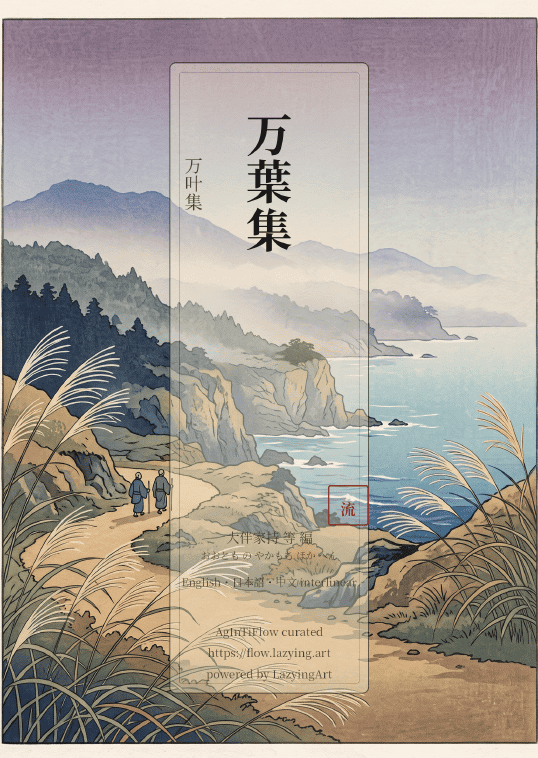 | `manyoshu` | 和歌仮名 main · English · 中文 | [Read](https://learn.lazying.art/pdf-reader.html?path=docs/pocketpolyglot/books/wayakana-en-jp-zh/manyoshu/wayakana-main-en-zh/color/%E4%B8%87%E8%91%89%E9%9B%86%EF%BC%88%E8%8B%B1%E6%96%87%E3%83%BB%E4%B8%AD%E6%96%87%E6%B3%A8%EF%BC%89%E3%83%BB%E6%9C%80%E5%A4%A7%E8%AA%9E%E7%A8%AE%E3%83%BB%E5%A4%A7%E5%AD%97%E7%89%88.pdf&title=%E4%B8%87%E8%91%89%E9%9B%86%EF%BC%88%E8%8B%B1%E6%96%87%E3%83%BB%E4%B8%AD%E6%96%87%E6%B3%A8%EF%BC%89) | [Read](https://learn.lazying.art/pdf-reader.html?path=docs/pocketpolyglot/books/wayakana-en-jp-zh/manyoshu/wayakana-main-en-zh/blackwhite/%E4%B8%87%E8%91%89%E9%9B%86%EF%BC%88%E8%8B%B1%E6%96%87%E3%83%BB%E4%B8%AD%E6%96%87%E6%B3%A8%E3%83%BB%E9%BB%91%E7%99%BD%EF%BC%89%E3%83%BB%E6%9C%80%E5%A4%A7%E8%AA%9E%E7%A8%AE%E3%83%BB%E5%A4%A7%E5%AD%97%E7%89%88.pdf&title=%E4%B8%87%E8%91%89%E9%9B%86%EF%BC%88%E8%8B%B1%E6%96%87%E3%83%BB%E4%B8%AD%E6%96%87%E6%B3%A8%EF%BC%89%20black-white) |
|  | `chuci` | 文言文 main · English · 日本語 · 中文 | [Read](https://learn.lazying.art/pdf-reader.html?path=docs/pocketpolyglot/books/wenyan-en-jp-zh/chuci/wenyan-main-quadrilingual/color/%E6%A5%9A%E8%BE%AD%EF%BC%88%E8%8B%B1%E6%96%87%E3%83%BB%E7%8F%BE%E4%BB%A3%E6%97%A5%E6%9C%AC%E8%AA%9E%E3%83%BB%E7%8F%BE%E4%BB%A3%E4%B8%AD%E6%96%87%E6%B3%A8%EF%BC%89%E3%83%BB%E6%9C%80%E5%A4%A7%E8%AA%9E%E7%A8%AE%E3%83%BB%E5%A4%A7%E5%AD%97%E7%89%88.pdf&title=%E6%A5%9A%E8%BE%AD%EF%BC%88%E8%8B%B1%E6%96%87%E3%83%BB%E7%8F%BE%E4%BB%A3%E6%97%A5%E6%9C%AC%E8%AA%9E%E3%83%BB%E7%8F%BE%E4%BB%A3%E4%B8%AD%E6%96%87%E6%B3%A8%EF%BC%89) | [Read](https://learn.lazying.art/pdf-reader.html?path=docs/pocketpolyglot/books/wenyan-en-jp-zh/chuci/wenyan-main-quadrilingual/blackwhite/%E6%A5%9A%E8%BE%AD%EF%BC%88%E8%8B%B1%E6%96%87%E3%83%BB%E7%8F%BE%E4%BB%A3%E6%97%A5%E6%9C%AC%E8%AA%9E%E3%83%BB%E7%8F%BE%E4%BB%A3%E4%B8%AD%E6%96%87%E6%B3%A8%E3%83%BB%E9%BB%91%E7%99%BD%EF%BC%89%E3%83%BB%E6%9C%80%E5%A4%A7%E8%AA%9E%E7%A8%AE%E3%83%BB%E5%A4%A7%E5%AD%97%E7%89%88.pdf&title=%E6%A5%9A%E8%BE%AD%EF%BC%88%E8%8B%B1%E6%96%87%E3%83%BB%E7%8F%BE%E4%BB%A3%E6%97%A5%E6%9C%AC%E8%AA%9E%E3%83%BB%E7%8F%BE%E4%BB%A3%E4%B8%AD%E6%96%87%E6%B3%A8%EF%BC%89%20black-white) |
|  | `foguoji` | 文言文 main · English · 日本語 · 中文 | [Read](https://learn.lazying.art/pdf-reader.html?path=docs/pocketpolyglot/books/wenyan-en-jp-zh/foguoji/wenyan-main-quadrilingual/color/%E4%BD%9B%E5%9C%8B%E8%A8%98%EF%BC%88%E8%8B%B1%E6%96%87%E3%83%BB%E7%8F%BE%E4%BB%A3%E6%97%A5%E6%9C%AC%E8%AA%9E%E3%83%BB%E7%8F%BE%E4%BB%A3%E4%B8%AD%E6%96%87%E6%B3%A8%EF%BC%89%E3%83%BB%E6%9C%80%E5%A4%A7%E8%AA%9E%E7%A8%AE%E3%83%BB%E5%A4%A7%E5%AD%97%E7%89%88.pdf&title=%E4%BD%9B%E5%9C%8B%E8%A8%98%EF%BC%88%E8%8B%B1%E6%96%87%E3%83%BB%E7%8F%BE%E4%BB%A3%E6%97%A5%E6%9C%AC%E8%AA%9E%E3%83%BB%E7%8F%BE%E4%BB%A3%E4%B8%AD%E6%96%87%E6%B3%A8%EF%BC%89) | [Read](https://learn.lazying.art/pdf-reader.html?path=docs/pocketpolyglot/books/wenyan-en-jp-zh/foguoji/wenyan-main-quadrilingual/blackwhite/%E4%BD%9B%E5%9C%8B%E8%A8%98%EF%BC%88%E8%8B%B1%E6%96%87%E3%83%BB%E7%8F%BE%E4%BB%A3%E6%97%A5%E6%9C%AC%E8%AA%9E%E3%83%BB%E7%8F%BE%E4%BB%A3%E4%B8%AD%E6%96%87%E6%B3%A8%E3%83%BB%E9%BB%91%E7%99%BD%EF%BC%89%E3%83%BB%E6%9C%80%E5%A4%A7%E8%AA%9E%E7%A8%AE%E3%83%BB%E5%A4%A7%E5%AD%97%E7%89%88.pdf&title=%E4%BD%9B%E5%9C%8B%E8%A8%98%EF%BC%88%E8%8B%B1%E6%96%87%E3%83%BB%E7%8F%BE%E4%BB%A3%E6%97%A5%E6%9C%AC%E8%AA%9E%E3%83%BB%E7%8F%BE%E4%BB%A3%E4%B8%AD%E6%96%87%E6%B3%A8%EF%BC%89%20black-white) |
|  | `han-shu` | 文言文 main · English · 日本語 · 中文 | [Read](https://learn.lazying.art/pdf-reader.html?path=docs/pocketpolyglot/books/wenyan-en-jp-zh/han-shu/wenyan-main-quadrilingual/color/%E6%BC%A2%E6%9B%B8%EF%BC%88%E8%8B%B1%E6%96%87%E3%83%BB%E7%8F%BE%E4%BB%A3%E6%97%A5%E6%9C%AC%E8%AA%9E%E3%83%BB%E7%8F%BE%E4%BB%A3%E4%B8%AD%E6%96%87%E6%B3%A8%EF%BC%89%E3%83%BB%E6%9C%80%E5%A4%A7%E8%AA%9E%E7%A8%AE%E3%83%BB%E5%A4%A7%E5%AD%97%E7%89%88.pdf&title=%E6%BC%A2%E6%9B%B8%EF%BC%88%E8%8B%B1%E6%96%87%E3%83%BB%E7%8F%BE%E4%BB%A3%E6%97%A5%E6%9C%AC%E8%AA%9E%E3%83%BB%E7%8F%BE%E4%BB%A3%E4%B8%AD%E6%96%87%E6%B3%A8%EF%BC%89) | [Read](https://learn.lazying.art/pdf-reader.html?path=docs/pocketpolyglot/books/wenyan-en-jp-zh/han-shu/wenyan-main-quadrilingual/blackwhite/%E6%BC%A2%E6%9B%B8%EF%BC%88%E8%8B%B1%E6%96%87%E3%83%BB%E7%8F%BE%E4%BB%A3%E6%97%A5%E6%9C%AC%E8%AA%9E%E3%83%BB%E7%8F%BE%E4%BB%A3%E4%B8%AD%E6%96%87%E6%B3%A8%E3%83%BB%E9%BB%91%E7%99%BD%EF%BC%89%E3%83%BB%E6%9C%80%E5%A4%A7%E8%AA%9E%E7%A8%AE%E3%83%BB%E5%A4%A7%E5%AD%97%E7%89%88.pdf&title=%E6%BC%A2%E6%9B%B8%EF%BC%88%E8%8B%B1%E6%96%87%E3%83%BB%E7%8F%BE%E4%BB%A3%E6%97%A5%E6%9C%AC%E8%AA%9E%E3%83%BB%E7%8F%BE%E4%BB%A3%E4%B8%AD%E6%96%87%E6%B3%A8%EF%BC%89%20black-white) |
|  | `hou-han-shu-part-01` | 文言文 main · English · 日本語 · 中文 | [Read](https://learn.lazying.art/pdf-reader.html?path=docs/pocketpolyglot/books/wenyan-en-jp-zh/hou-han-shu-part-01/wenyan-main-quadrilingual/color/%E5%BE%8C%E6%BC%A2%E6%9B%B8%E7%AC%AC%E4%B8%80%E9%83%A8%EF%BC%88%E8%8B%B1%E6%96%87%E3%83%BB%E7%8F%BE%E4%BB%A3%E6%97%A5%E6%9C%AC%E8%AA%9E%E3%83%BB%E7%8F%BE%E4%BB%A3%E4%B8%AD%E6%96%87%E6%B3%A8%EF%BC%89%E3%83%BB%E6%9C%80%E5%A4%A7%E8%AA%9E%E7%A8%AE%E3%83%BB%E5%A4%A7%E5%AD%97%E7%89%88.pdf&title=%E5%BE%8C%E6%BC%A2%E6%9B%B8%E7%AC%AC%E4%B8%80%E9%83%A8%EF%BC%88%E8%8B%B1%E6%96%87%E3%83%BB%E7%8F%BE%E4%BB%A3%E6%97%A5%E6%9C%AC%E8%AA%9E%E3%83%BB%E7%8F%BE%E4%BB%A3%E4%B8%AD%E6%96%87%E6%B3%A8%EF%BC%89) | [Read](https://learn.lazying.art/pdf-reader.html?path=docs/pocketpolyglot/books/wenyan-en-jp-zh/hou-han-shu-part-01/wenyan-main-quadrilingual/blackwhite/%E5%BE%8C%E6%BC%A2%E6%9B%B8%E7%AC%AC%E4%B8%80%E9%83%A8%EF%BC%88%E8%8B%B1%E6%96%87%E3%83%BB%E7%8F%BE%E4%BB%A3%E6%97%A5%E6%9C%AC%E8%AA%9E%E3%83%BB%E7%8F%BE%E4%BB%A3%E4%B8%AD%E6%96%87%E6%B3%A8%E3%83%BB%E9%BB%91%E7%99%BD%EF%BC%89%E3%83%BB%E6%9C%80%E5%A4%A7%E8%AA%9E%E7%A8%AE%E3%83%BB%E5%A4%A7%E5%AD%97%E7%89%88.pdf&title=%E5%BE%8C%E6%BC%A2%E6%9B%B8%E7%AC%AC%E4%B8%80%E9%83%A8%EF%BC%88%E8%8B%B1%E6%96%87%E3%83%BB%E7%8F%BE%E4%BB%A3%E6%97%A5%E6%9C%AC%E8%AA%9E%E3%83%BB%E7%8F%BE%E4%BB%A3%E4%B8%AD%E6%96%87%E6%B3%A8%EF%BC%89%20black-white) |
| 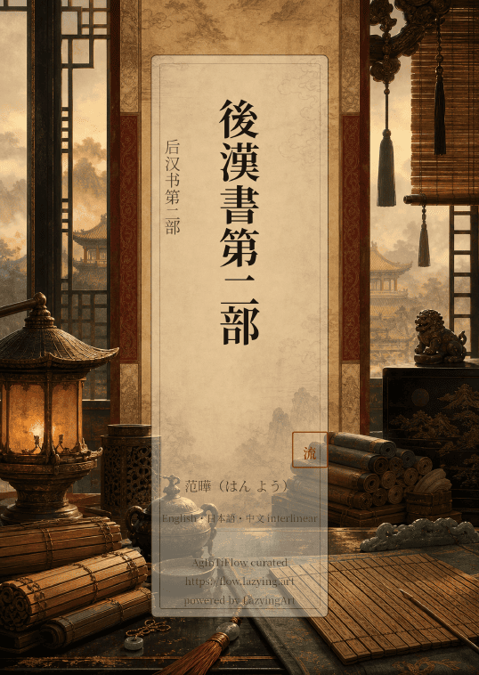 | `hou-han-shu-part-02` | 文言文 main · English · 日本語 · 中文 | [Read](https://learn.lazying.art/pdf-reader.html?path=docs/pocketpolyglot/books/wenyan-en-jp-zh/hou-han-shu-part-02/wenyan-main-quadrilingual/color/%E5%BE%8C%E6%BC%A2%E6%9B%B8%E7%AC%AC%E4%BA%8C%E9%83%A8%EF%BC%88%E8%8B%B1%E6%96%87%E3%83%BB%E7%8F%BE%E4%BB%A3%E6%97%A5%E6%9C%AC%E8%AA%9E%E3%83%BB%E7%8F%BE%E4%BB%A3%E4%B8%AD%E6%96%87%E6%B3%A8%EF%BC%89%E3%83%BB%E6%9C%80%E5%A4%A7%E8%AA%9E%E7%A8%AE%E3%83%BB%E5%A4%A7%E5%AD%97%E7%89%88.pdf&title=%E5%BE%8C%E6%BC%A2%E6%9B%B8%E7%AC%AC%E4%BA%8C%E9%83%A8%EF%BC%88%E8%8B%B1%E6%96%87%E3%83%BB%E7%8F%BE%E4%BB%A3%E6%97%A5%E6%9C%AC%E8%AA%9E%E3%83%BB%E7%8F%BE%E4%BB%A3%E4%B8%AD%E6%96%87%E6%B3%A8%EF%BC%89) | [Read](https://learn.lazying.art/pdf-reader.html?path=docs/pocketpolyglot/books/wenyan-en-jp-zh/hou-han-shu-part-02/wenyan-main-quadrilingual/blackwhite/%E5%BE%8C%E6%BC%A2%E6%9B%B8%E7%AC%AC%E4%BA%8C%E9%83%A8%EF%BC%88%E8%8B%B1%E6%96%87%E3%83%BB%E7%8F%BE%E4%BB%A3%E6%97%A5%E6%9C%AC%E8%AA%9E%E3%83%BB%E7%8F%BE%E4%BB%A3%E4%B8%AD%E6%96%87%E6%B3%A8%E3%83%BB%E9%BB%91%E7%99%BD%EF%BC%89%E3%83%BB%E6%9C%80%E5%A4%A7%E8%AA%9E%E7%A8%AE%E3%83%BB%E5%A4%A7%E5%AD%97%E7%89%88.pdf&title=%E5%BE%8C%E6%BC%A2%E6%9B%B8%E7%AC%AC%E4%BA%8C%E9%83%A8%EF%BC%88%E8%8B%B1%E6%96%87%E3%83%BB%E7%8F%BE%E4%BB%A3%E6%97%A5%E6%9C%AC%E8%AA%9E%E3%83%BB%E7%8F%BE%E4%BB%A3%E4%B8%AD%E6%96%87%E6%B3%A8%EF%BC%89%20black-white) |
| 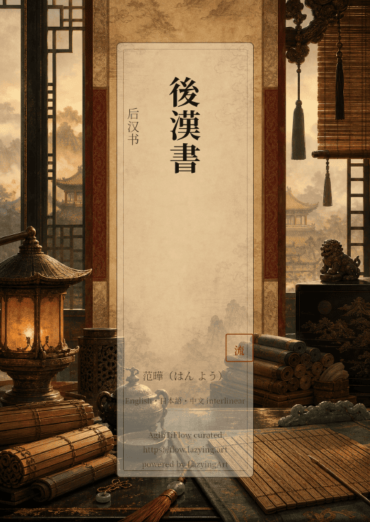 | `hou-han-shu-part-03` | 文言文 main · English · 日本語 · 中文 | [Read](https://learn.lazying.art/pdf-reader.html?path=docs/pocketpolyglot/books/wenyan-en-jp-zh/hou-han-shu-part-03/wenyan-main-quadrilingual/color/%E5%BE%8C%E6%BC%A2%E6%9B%B8%E7%AC%AC%E4%B8%89%E9%83%A8%EF%BC%88%E8%8B%B1%E6%96%87%E3%83%BB%E7%8F%BE%E4%BB%A3%E6%97%A5%E6%9C%AC%E8%AA%9E%E3%83%BB%E7%8F%BE%E4%BB%A3%E4%B8%AD%E6%96%87%E6%B3%A8%EF%BC%89%E3%83%BB%E6%9C%80%E5%A4%A7%E8%AA%9E%E7%A8%AE%E3%83%BB%E5%A4%A7%E5%AD%97%E7%89%88.pdf&title=%E5%BE%8C%E6%BC%A2%E6%9B%B8%E7%AC%AC%E4%B8%89%E9%83%A8%EF%BC%88%E8%8B%B1%E6%96%87%E3%83%BB%E7%8F%BE%E4%BB%A3%E6%97%A5%E6%9C%AC%E8%AA%9E%E3%83%BB%E7%8F%BE%E4%BB%A3%E4%B8%AD%E6%96%87%E6%B3%A8%EF%BC%89) | [Read](https://learn.lazying.art/pdf-reader.html?path=docs/pocketpolyglot/books/wenyan-en-jp-zh/hou-han-shu-part-03/wenyan-main-quadrilingual/blackwhite/%E5%BE%8C%E6%BC%A2%E6%9B%B8%E7%AC%AC%E4%B8%89%E9%83%A8%EF%BC%88%E8%8B%B1%E6%96%87%E3%83%BB%E7%8F%BE%E4%BB%A3%E6%97%A5%E6%9C%AC%E8%AA%9E%E3%83%BB%E7%8F%BE%E4%BB%A3%E4%B8%AD%E6%96%87%E6%B3%A8%E3%83%BB%E9%BB%91%E7%99%BD%EF%BC%89%E3%83%BB%E6%9C%80%E5%A4%A7%E8%AA%9E%E7%A8%AE%E3%83%BB%E5%A4%A7%E5%AD%97%E7%89%88.pdf&title=%E5%BE%8C%E6%BC%A2%E6%9B%B8%E7%AC%AC%E4%B8%89%E9%83%A8%EF%BC%88%E8%8B%B1%E6%96%87%E3%83%BB%E7%8F%BE%E4%BB%A3%E6%97%A5%E6%9C%AC%E8%AA%9E%E3%83%BB%E7%8F%BE%E4%BB%A3%E4%B8%AD%E6%96%87%E6%B3%A8%EF%BC%89%20black-white) |
| 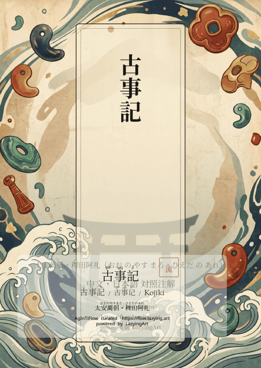 | `kojiki-wenyan` | 文言文 main · English · 日本語 · 中文 | [Read](https://learn.lazying.art/pdf-reader.html?path=docs/pocketpolyglot/books/wenyan-en-jp-zh/kojiki-wenyan/wenyan-main-quadrilingual/color/%E5%8F%A4%E4%BA%8B%E8%A8%98%EF%BC%88%E7%8F%BE%E4%BB%A3%E6%97%A5%E6%9C%AC%E8%AA%9E%E3%83%BB%E7%8F%BE%E4%BB%A3%E4%B8%AD%E6%96%87%E3%83%BB%E8%8B%B1%E6%96%87%E6%B3%A8%EF%BC%89%E3%83%BB%E6%9C%80%E5%A4%A7%E8%AA%9E%E7%A8%AE%E3%83%BB%E5%A4%A7%E5%AD%97%E7%89%88.pdf&title=%E5%8F%A4%E4%BA%8B%E8%A8%98%EF%BC%88%E7%8F%BE%E4%BB%A3%E6%97%A5%E6%9C%AC%E8%AA%9E%E3%83%BB%E7%8F%BE%E4%BB%A3%E4%B8%AD%E6%96%87%E3%83%BB%E8%8B%B1%E6%96%87%E6%B3%A8%EF%BC%89) | [Read](https://learn.lazying.art/pdf-reader.html?path=docs/pocketpolyglot/books/wenyan-en-jp-zh/kojiki-wenyan/wenyan-main-quadrilingual/blackwhite/%E5%8F%A4%E4%BA%8B%E8%A8%98%EF%BC%88%E7%8F%BE%E4%BB%A3%E6%97%A5%E6%9C%AC%E8%AA%9E%E3%83%BB%E7%8F%BE%E4%BB%A3%E4%B8%AD%E6%96%87%E3%83%BB%E8%8B%B1%E6%96%87%E6%B3%A8%E3%83%BB%E9%BB%91%E7%99%BD%EF%BC%89%E3%83%BB%E6%9C%80%E5%A4%A7%E8%AA%9E%E7%A8%AE%E3%83%BB%E5%A4%A7%E5%AD%97%E7%89%88.pdf&title=%E5%8F%A4%E4%BA%8B%E8%A8%98%EF%BC%88%E7%8F%BE%E4%BB%A3%E6%97%A5%E6%9C%AC%E8%AA%9E%E3%83%BB%E7%8F%BE%E4%BB%A3%E4%B8%AD%E6%96%87%E3%83%BB%E8%8B%B1%E6%96%87%E6%B3%A8%EF%BC%89%20black-white) |
|  | `mudanting` | 文言文 main · English · 日本語 · 中文 | [Read](https://learn.lazying.art/pdf-reader.html?path=docs/pocketpolyglot/books/wenyan-en-jp-zh/mudanting/wenyan-main-quadrilingual/color/%E7%89%A1%E4%B8%B9%E4%BA%AD%EF%BC%88%E8%8B%B1%E6%96%87%E3%83%BB%E7%8F%BE%E4%BB%A3%E6%97%A5%E6%9C%AC%E8%AA%9E%E3%83%BB%E7%8F%BE%E4%BB%A3%E4%B8%AD%E6%96%87%E6%B3%A8%EF%BC%89%E3%83%BB%E6%9C%80%E5%A4%A7%E8%AA%9E%E7%A8%AE%E3%83%BB%E5%A4%A7%E5%AD%97%E7%89%88.pdf&title=%E7%89%A1%E4%B8%B9%E4%BA%AD%EF%BC%88%E8%8B%B1%E6%96%87%E3%83%BB%E7%8F%BE%E4%BB%A3%E6%97%A5%E6%9C%AC%E8%AA%9E%E3%83%BB%E7%8F%BE%E4%BB%A3%E4%B8%AD%E6%96%87%E6%B3%A8%EF%BC%89) | [Read](https://learn.lazying.art/pdf-reader.html?path=docs/pocketpolyglot/books/wenyan-en-jp-zh/mudanting/wenyan-main-quadrilingual/blackwhite/%E7%89%A1%E4%B8%B9%E4%BA%AD%EF%BC%88%E8%8B%B1%E6%96%87%E3%83%BB%E7%8F%BE%E4%BB%A3%E6%97%A5%E6%9C%AC%E8%AA%9E%E3%83%BB%E7%8F%BE%E4%BB%A3%E4%B8%AD%E6%96%87%E6%B3%A8%E3%83%BB%E9%BB%91%E7%99%BD%EF%BC%89%E3%83%BB%E6%9C%80%E5%A4%A7%E8%AA%9E%E7%A8%AE%E3%83%BB%E5%A4%A7%E5%AD%97%E7%89%88.pdf&title=%E7%89%A1%E4%B8%B9%E4%BA%AD%EF%BC%88%E8%8B%B1%E6%96%87%E3%83%BB%E7%8F%BE%E4%BB%A3%E6%97%A5%E6%9C%AC%E8%AA%9E%E3%83%BB%E7%8F%BE%E4%BB%A3%E4%B8%AD%E6%96%87%E6%B3%A8%EF%BC%89%20black-white) |
| 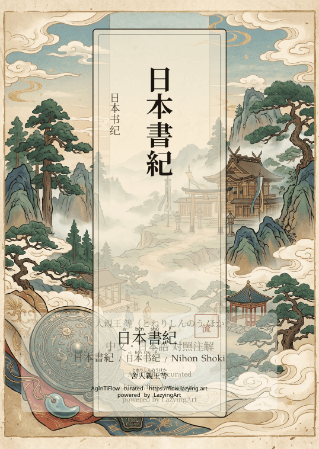 | `nihon-shoki` | 文言文 main · English · 日本語 · 中文 | [Read](https://learn.lazying.art/pdf-reader.html?path=docs/pocketpolyglot/books/wenyan-en-jp-zh/nihon-shoki/wenyan-main-quadrilingual/color/%E6%97%A5%E6%9C%AC%E6%9B%B8%E7%B4%80%EF%BC%88%E7%8F%BE%E4%BB%A3%E6%97%A5%E6%9C%AC%E8%AA%9E%E3%83%BB%E7%8F%BE%E4%BB%A3%E4%B8%AD%E6%96%87%E3%83%BB%E8%8B%B1%E6%96%87%E6%B3%A8%EF%BC%89%E3%83%BB%E6%9C%80%E5%A4%A7%E8%AA%9E%E7%A8%AE%E3%83%BB%E5%A4%A7%E5%AD%97%E7%89%88.pdf&title=%E6%97%A5%E6%9C%AC%E6%9B%B8%E7%B4%80%EF%BC%88%E7%8F%BE%E4%BB%A3%E6%97%A5%E6%9C%AC%E8%AA%9E%E3%83%BB%E7%8F%BE%E4%BB%A3%E4%B8%AD%E6%96%87%E3%83%BB%E8%8B%B1%E6%96%87%E6%B3%A8%EF%BC%89) | [Read](https://learn.lazying.art/pdf-reader.html?path=docs/pocketpolyglot/books/wenyan-en-jp-zh/nihon-shoki/wenyan-main-quadrilingual/blackwhite/%E6%97%A5%E6%9C%AC%E6%9B%B8%E7%B4%80%EF%BC%88%E7%8F%BE%E4%BB%A3%E6%97%A5%E6%9C%AC%E8%AA%9E%E3%83%BB%E7%8F%BE%E4%BB%A3%E4%B8%AD%E6%96%87%E3%83%BB%E8%8B%B1%E6%96%87%E6%B3%A8%E3%83%BB%E9%BB%91%E7%99%BD%EF%BC%89%E3%83%BB%E6%9C%80%E5%A4%A7%E8%AA%9E%E7%A8%AE%E3%83%BB%E5%A4%A7%E5%AD%97%E7%89%88.pdf&title=%E6%97%A5%E6%9C%AC%E6%9B%B8%E7%B4%80%EF%BC%88%E7%8F%BE%E4%BB%A3%E6%97%A5%E6%9C%AC%E8%AA%9E%E3%83%BB%E7%8F%BE%E4%BB%A3%E4%B8%AD%E6%96%87%E3%83%BB%E8%8B%B1%E6%96%87%E6%B3%A8%EF%BC%89%20black-white) |
| 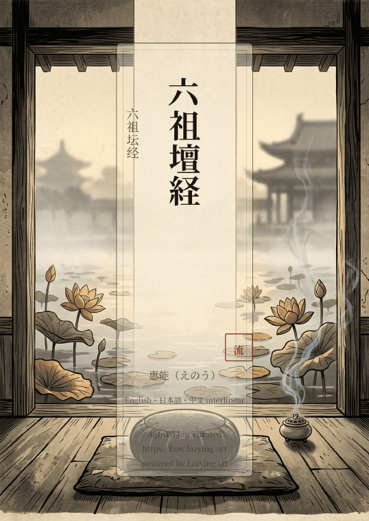 | `platform-sutra` | 文言文 main · English · 日本語 · 中文 | [Read](https://learn.lazying.art/pdf-reader.html?path=docs/pocketpolyglot/books/wenyan-en-jp-zh/platform-sutra/wenyan-main-quadrilingual/color/%E5%85%AD%E7%A5%96%E5%A4%A7%E5%B8%AB%E6%B3%95%E5%AF%B6%E5%A3%87%E7%B6%93%EF%BC%88%E8%8B%B1%E6%96%87%E3%83%BB%E7%8F%BE%E4%BB%A3%E6%97%A5%E6%9C%AC%E8%AA%9E%E3%83%BB%E7%8F%BE%E4%BB%A3%E4%B8%AD%E6%96%87%E6%B3%A8%EF%BC%89%E3%83%BB%E6%9C%80%E5%A4%A7%E8%AA%9E%E7%A8%AE%E3%83%BB%E5%A4%A7%E5%AD%97%E7%89%88.pdf&title=%E5%85%AD%E7%A5%96%E5%A4%A7%E5%B8%AB%E6%B3%95%E5%AF%B6%E5%A3%87%E7%B6%93%EF%BC%88%E8%8B%B1%E6%96%87%E3%83%BB%E7%8F%BE%E4%BB%A3%E6%97%A5%E6%9C%AC%E8%AA%9E%E3%83%BB%E7%8F%BE%E4%BB%A3%E4%B8%AD%E6%96%87%E6%B3%A8%EF%BC%89) | [Read](https://learn.lazying.art/pdf-reader.html?path=docs/pocketpolyglot/books/wenyan-en-jp-zh/platform-sutra/wenyan-main-quadrilingual/blackwhite/%E5%85%AD%E7%A5%96%E5%A4%A7%E5%B8%AB%E6%B3%95%E5%AF%B6%E5%A3%87%E7%B6%93%EF%BC%88%E8%8B%B1%E6%96%87%E3%83%BB%E7%8F%BE%E4%BB%A3%E6%97%A5%E6%9C%AC%E8%AA%9E%E3%83%BB%E7%8F%BE%E4%BB%A3%E4%B8%AD%E6%96%87%E6%B3%A8%E3%83%BB%E9%BB%91%E7%99%BD%EF%BC%89%E3%83%BB%E6%9C%80%E5%A4%A7%E8%AA%9E%E7%A8%AE%E3%83%BB%E5%A4%A7%E5%AD%97%E7%89%88.pdf&title=%E5%85%AD%E7%A5%96%E5%A4%A7%E5%B8%AB%E6%B3%95%E5%AF%B6%E5%A3%87%E7%B6%93%EF%BC%88%E8%8B%B1%E6%96%87%E3%83%BB%E7%8F%BE%E4%BB%A3%E6%97%A5%E6%9C%AC%E8%AA%9E%E3%83%BB%E7%8F%BE%E4%BB%A3%E4%B8%AD%E6%96%87%E6%B3%A8%EF%BC%89%20black-white) |
|  | `sanguozhi` | 文言文 main · English · 日本語 · 中文 | [Read](https://learn.lazying.art/pdf-reader.html?path=docs/pocketpolyglot/books/wenyan-en-jp-zh/sanguozhi/wenyan-main-quadrilingual/color/%E4%B8%89%E5%9C%8B%E5%BF%97%EF%BC%88%E8%8B%B1%E6%96%87%E3%83%BB%E7%8F%BE%E4%BB%A3%E6%97%A5%E6%9C%AC%E8%AA%9E%E3%83%BB%E7%8F%BE%E4%BB%A3%E4%B8%AD%E6%96%87%E6%B3%A8%EF%BC%89%E3%83%BB%E6%9C%80%E5%A4%A7%E8%AA%9E%E7%A8%AE%E3%83%BB%E5%A4%A7%E5%AD%97%E7%89%88.pdf&title=%E4%B8%89%E5%9C%8B%E5%BF%97%EF%BC%88%E8%8B%B1%E6%96%87%E3%83%BB%E7%8F%BE%E4%BB%A3%E6%97%A5%E6%9C%AC%E8%AA%9E%E3%83%BB%E7%8F%BE%E4%BB%A3%E4%B8%AD%E6%96%87%E6%B3%A8%EF%BC%89) | [Read](https://learn.lazying.art/pdf-reader.html?path=docs/pocketpolyglot/books/wenyan-en-jp-zh/sanguozhi/wenyan-main-quadrilingual/blackwhite/%E4%B8%89%E5%9C%8B%E5%BF%97%EF%BC%88%E8%8B%B1%E6%96%87%E3%83%BB%E7%8F%BE%E4%BB%A3%E6%97%A5%E6%9C%AC%E8%AA%9E%E3%83%BB%E7%8F%BE%E4%BB%A3%E4%B8%AD%E6%96%87%E6%B3%A8%E3%83%BB%E9%BB%91%E7%99%BD%EF%BC%89%E3%83%BB%E6%9C%80%E5%A4%A7%E8%AA%9E%E7%A8%AE%E3%83%BB%E5%A4%A7%E5%AD%97%E7%89%88.pdf&title=%E4%B8%89%E5%9C%8B%E5%BF%97%EF%BC%88%E8%8B%B1%E6%96%87%E3%83%BB%E7%8F%BE%E4%BB%A3%E6%97%A5%E6%9C%AC%E8%AA%9E%E3%83%BB%E7%8F%BE%E4%BB%A3%E4%B8%AD%E6%96%87%E6%B3%A8%EF%BC%89%20black-white) |
| 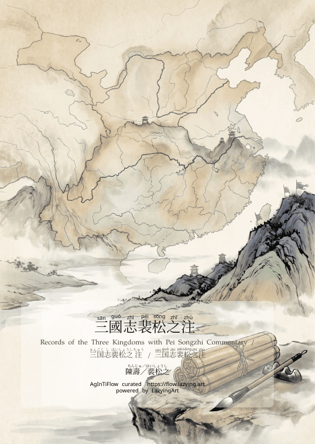 | `sanguozhi-pei-zhu` | 文言文 main · English · 日本語 · 中文 | [Read](https://learn.lazying.art/pdf-reader.html?path=docs/pocketpolyglot/books/wenyan-en-jp-zh/sanguozhi-pei-zhu/wenyan-main-quadrilingual/color/%E4%B8%89%E5%9C%8B%E5%BF%97%E8%A3%B4%E6%9D%BE%E4%B9%8B%E6%B3%A8%EF%BC%88%E8%8B%B1%E6%96%87%E3%83%BB%E7%8F%BE%E4%BB%A3%E6%97%A5%E6%9C%AC%E8%AA%9E%E3%83%BB%E7%8F%BE%E4%BB%A3%E4%B8%AD%E6%96%87%E6%B3%A8%EF%BC%89%E3%83%BB%E6%9C%80%E5%A4%A7%E8%AA%9E%E7%A8%AE%E3%83%BB%E5%A4%A7%E5%AD%97%E7%89%88.pdf&title=%E4%B8%89%E5%9C%8B%E5%BF%97%E8%A3%B4%E6%9D%BE%E4%B9%8B%E6%B3%A8%EF%BC%88%E8%8B%B1%E6%96%87%E3%83%BB%E7%8F%BE%E4%BB%A3%E6%97%A5%E6%9C%AC%E8%AA%9E%E3%83%BB%E7%8F%BE%E4%BB%A3%E4%B8%AD%E6%96%87%E6%B3%A8%EF%BC%89) | [Read](https://learn.lazying.art/pdf-reader.html?path=docs/pocketpolyglot/books/wenyan-en-jp-zh/sanguozhi-pei-zhu/wenyan-main-quadrilingual/blackwhite/%E4%B8%89%E5%9C%8B%E5%BF%97%E8%A3%B4%E6%9D%BE%E4%B9%8B%E6%B3%A8%EF%BC%88%E8%8B%B1%E6%96%87%E3%83%BB%E7%8F%BE%E4%BB%A3%E6%97%A5%E6%9C%AC%E8%AA%9E%E3%83%BB%E7%8F%BE%E4%BB%A3%E4%B8%AD%E6%96%87%E6%B3%A8%E3%83%BB%E9%BB%91%E7%99%BD%EF%BC%89%E3%83%BB%E6%9C%80%E5%A4%A7%E8%AA%9E%E7%A8%AE%E3%83%BB%E5%A4%A7%E5%AD%97%E7%89%88.pdf&title=%E4%B8%89%E5%9C%8B%E5%BF%97%E8%A3%B4%E6%9D%BE%E4%B9%8B%E6%B3%A8%EF%BC%88%E8%8B%B1%E6%96%87%E3%83%BB%E7%8F%BE%E4%BB%A3%E6%97%A5%E6%9C%AC%E8%AA%9E%E3%83%BB%E7%8F%BE%E4%BB%A3%E4%B8%AD%E6%96%87%E6%B3%A8%EF%BC%89%20black-white) |
|  | `shanhaijing` | 文言文 main · English · 日本語 · 中文 | [Read](https://learn.lazying.art/pdf-reader.html?path=docs/pocketpolyglot/books/wenyan-en-jp-zh/shanhaijing/wenyan-main-quadrilingual/color/%E5%B1%B1%E6%B5%B7%E7%B6%93%EF%BC%88%E8%8B%B1%E6%96%87%E3%83%BB%E7%8F%BE%E4%BB%A3%E6%97%A5%E6%9C%AC%E8%AA%9E%E3%83%BB%E7%8F%BE%E4%BB%A3%E4%B8%AD%E6%96%87%E6%B3%A8%EF%BC%89%E3%83%BB%E6%9C%80%E5%A4%A7%E8%AA%9E%E7%A8%AE%E3%83%BB%E5%A4%A7%E5%AD%97%E7%89%88.pdf&title=%E5%B1%B1%E6%B5%B7%E7%B6%93%EF%BC%88%E8%8B%B1%E6%96%87%E3%83%BB%E7%8F%BE%E4%BB%A3%E6%97%A5%E6%9C%AC%E8%AA%9E%E3%83%BB%E7%8F%BE%E4%BB%A3%E4%B8%AD%E6%96%87%E6%B3%A8%EF%BC%89) | [Read](https://learn.lazying.art/pdf-reader.html?path=docs/pocketpolyglot/books/wenyan-en-jp-zh/shanhaijing/wenyan-main-quadrilingual/blackwhite/%E5%B1%B1%E6%B5%B7%E7%B6%93%EF%BC%88%E8%8B%B1%E6%96%87%E3%83%BB%E7%8F%BE%E4%BB%A3%E6%97%A5%E6%9C%AC%E8%AA%9E%E3%83%BB%E7%8F%BE%E4%BB%A3%E4%B8%AD%E6%96%87%E6%B3%A8%E3%83%BB%E9%BB%91%E7%99%BD%EF%BC%89%E3%83%BB%E6%9C%80%E5%A4%A7%E8%AA%9E%E7%A8%AE%E3%83%BB%E5%A4%A7%E5%AD%97%E7%89%88.pdf&title=%E5%B1%B1%E6%B5%B7%E7%B6%93%EF%BC%88%E8%8B%B1%E6%96%87%E3%83%BB%E7%8F%BE%E4%BB%A3%E6%97%A5%E6%9C%AC%E8%AA%9E%E3%83%BB%E7%8F%BE%E4%BB%A3%E4%B8%AD%E6%96%87%E6%B3%A8%EF%BC%89%20black-white) |
| 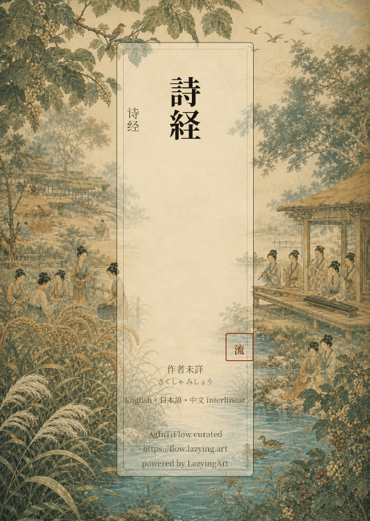 | `shijing` | 文言文 main · English · 日本語 · 中文 | [Read](https://learn.lazying.art/pdf-reader.html?path=docs/pocketpolyglot/books/wenyan-en-jp-zh/shijing/wenyan-main-quadrilingual/color/%E8%A9%A9%E7%B6%93%EF%BC%88%E8%8B%B1%E6%96%87%E3%83%BB%E7%8F%BE%E4%BB%A3%E6%97%A5%E6%9C%AC%E8%AA%9E%E3%83%BB%E7%8F%BE%E4%BB%A3%E4%B8%AD%E6%96%87%E6%B3%A8%EF%BC%89%E3%83%BB%E6%9C%80%E5%A4%A7%E8%AA%9E%E7%A8%AE%E3%83%BB%E5%A4%A7%E5%AD%97%E7%89%88.pdf&title=%E8%A9%A9%E7%B6%93%EF%BC%88%E8%8B%B1%E6%96%87%E3%83%BB%E7%8F%BE%E4%BB%A3%E6%97%A5%E6%9C%AC%E8%AA%9E%E3%83%BB%E7%8F%BE%E4%BB%A3%E4%B8%AD%E6%96%87%E6%B3%A8%EF%BC%89) | [Read](https://learn.lazying.art/pdf-reader.html?path=docs/pocketpolyglot/books/wenyan-en-jp-zh/shijing/wenyan-main-quadrilingual/blackwhite/%E8%A9%A9%E7%B6%93%EF%BC%88%E8%8B%B1%E6%96%87%E3%83%BB%E7%8F%BE%E4%BB%A3%E6%97%A5%E6%9C%AC%E8%AA%9E%E3%83%BB%E7%8F%BE%E4%BB%A3%E4%B8%AD%E6%96%87%E6%B3%A8%E3%83%BB%E9%BB%91%E7%99%BD%EF%BC%89%E3%83%BB%E6%9C%80%E5%A4%A7%E8%AA%9E%E7%A8%AE%E3%83%BB%E5%A4%A7%E5%AD%97%E7%89%88.pdf&title=%E8%A9%A9%E7%B6%93%EF%BC%88%E8%8B%B1%E6%96%87%E3%83%BB%E7%8F%BE%E4%BB%A3%E6%97%A5%E6%9C%AC%E8%AA%9E%E3%83%BB%E7%8F%BE%E4%BB%A3%E4%B8%AD%E6%96%87%E6%B3%A8%EF%BC%89%20black-white) |
|  | `shui-jing-zhu` | 文言文 main · English · 日本語 · 中文 | [Read](https://learn.lazying.art/pdf-reader.html?path=docs/pocketpolyglot/books/wenyan-en-jp-zh/shui-jing-zhu/wenyan-main-quadrilingual/color/%E6%B0%B4%E7%B6%93%E6%B3%A8%EF%BC%88%E8%8B%B1%E6%96%87%E3%83%BB%E7%8F%BE%E4%BB%A3%E6%97%A5%E6%9C%AC%E8%AA%9E%E3%83%BB%E7%8F%BE%E4%BB%A3%E4%B8%AD%E6%96%87%E6%B3%A8%EF%BC%89%E3%83%BB%E6%9C%80%E5%A4%A7%E8%AA%9E%E7%A8%AE%E3%83%BB%E5%A4%A7%E5%AD%97%E7%89%88.pdf&title=%E6%B0%B4%E7%B6%93%E6%B3%A8%EF%BC%88%E8%8B%B1%E6%96%87%E3%83%BB%E7%8F%BE%E4%BB%A3%E6%97%A5%E6%9C%AC%E8%AA%9E%E3%83%BB%E7%8F%BE%E4%BB%A3%E4%B8%AD%E6%96%87%E6%B3%A8%EF%BC%89) | [Read](https://learn.lazying.art/pdf-reader.html?path=docs/pocketpolyglot/books/wenyan-en-jp-zh/shui-jing-zhu/wenyan-main-quadrilingual/blackwhite/%E6%B0%B4%E7%B6%93%E6%B3%A8%EF%BC%88%E8%8B%B1%E6%96%87%E3%83%BB%E7%8F%BE%E4%BB%A3%E6%97%A5%E6%9C%AC%E8%AA%9E%E3%83%BB%E7%8F%BE%E4%BB%A3%E4%B8%AD%E6%96%87%E6%B3%A8%E3%83%BB%E9%BB%91%E7%99%BD%EF%BC%89%E3%83%BB%E6%9C%80%E5%A4%A7%E8%AA%9E%E7%A8%AE%E3%83%BB%E5%A4%A7%E5%AD%97%E7%89%88.pdf&title=%E6%B0%B4%E7%B6%93%E6%B3%A8%EF%BC%88%E8%8B%B1%E6%96%87%E3%83%BB%E7%8F%BE%E4%BB%A3%E6%97%A5%E6%9C%AC%E8%AA%9E%E3%83%BB%E7%8F%BE%E4%BB%A3%E4%B8%AD%E6%96%87%E6%B3%A8%EF%BC%89%20black-white) |
|  | `tangshi-sanbai` | 文言文 main · English · 日本語 · 中文 | [Read](https://learn.lazying.art/pdf-reader.html?path=docs/pocketpolyglot/books/wenyan-en-jp-zh/tangshi-sanbai/wenyan-main-quadrilingual/color/%E5%94%90%E8%A9%A9%E4%B8%89%E7%99%BE%E9%A6%96%EF%BC%88%E8%8B%B1%E6%96%87%E3%83%BB%E7%8F%BE%E4%BB%A3%E6%97%A5%E6%9C%AC%E8%AA%9E%E3%83%BB%E7%8F%BE%E4%BB%A3%E4%B8%AD%E6%96%87%E6%B3%A8%EF%BC%89%E3%83%BB%E6%9C%80%E5%A4%A7%E8%AA%9E%E7%A8%AE%E3%83%BB%E5%A4%A7%E5%AD%97%E7%89%88.pdf&title=%E5%94%90%E8%A9%A9%E4%B8%89%E7%99%BE%E9%A6%96%EF%BC%88%E8%8B%B1%E6%96%87%E3%83%BB%E7%8F%BE%E4%BB%A3%E6%97%A5%E6%9C%AC%E8%AA%9E%E3%83%BB%E7%8F%BE%E4%BB%A3%E4%B8%AD%E6%96%87%E6%B3%A8%EF%BC%89) | [Read](https://learn.lazying.art/pdf-reader.html?path=docs/pocketpolyglot/books/wenyan-en-jp-zh/tangshi-sanbai/wenyan-main-quadrilingual/blackwhite/%E5%94%90%E8%A9%A9%E4%B8%89%E7%99%BE%E9%A6%96%EF%BC%88%E8%8B%B1%E6%96%87%E3%83%BB%E7%8F%BE%E4%BB%A3%E6%97%A5%E6%9C%AC%E8%AA%9E%E3%83%BB%E7%8F%BE%E4%BB%A3%E4%B8%AD%E6%96%87%E6%B3%A8%E3%83%BB%E9%BB%91%E7%99%BD%EF%BC%89%E3%83%BB%E6%9C%80%E5%A4%A7%E8%AA%9E%E7%A8%AE%E3%83%BB%E5%A4%A7%E5%AD%97%E7%89%88.pdf&title=%E5%94%90%E8%A9%A9%E4%B8%89%E7%99%BE%E9%A6%96%EF%BC%88%E8%8B%B1%E6%96%87%E3%83%BB%E7%8F%BE%E4%BB%A3%E6%97%A5%E6%9C%AC%E8%AA%9E%E3%83%BB%E7%8F%BE%E4%BB%A3%E4%B8%AD%E6%96%87%E6%B3%A8%EF%BC%89%20black-white) |
| 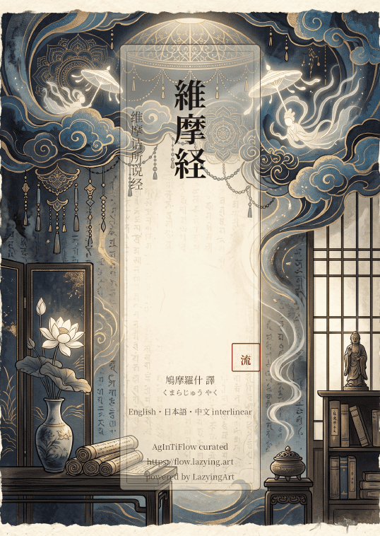 | `vimalakirti-sutra` | 文言文 main · English · 日本語 · 中文 | [Read](https://learn.lazying.art/pdf-reader.html?path=docs/pocketpolyglot/books/wenyan-en-jp-zh/vimalakirti-sutra/wenyan-main-quadrilingual/color/%E7%B6%AD%E6%91%A9%E8%A9%B0%E6%89%80%E8%AA%AA%E7%B6%93%EF%BC%88%E8%8B%B1%E6%96%87%E3%83%BB%E7%8F%BE%E4%BB%A3%E6%97%A5%E6%9C%AC%E8%AA%9E%E3%83%BB%E7%8F%BE%E4%BB%A3%E4%B8%AD%E6%96%87%E6%B3%A8%EF%BC%89%E3%83%BB%E6%9C%80%E5%A4%A7%E8%AA%9E%E7%A8%AE%E3%83%BB%E5%A4%A7%E5%AD%97%E7%89%88.pdf&title=%E7%B6%AD%E6%91%A9%E8%A9%B0%E6%89%80%E8%AA%AA%E7%B6%93%EF%BC%88%E8%8B%B1%E6%96%87%E3%83%BB%E7%8F%BE%E4%BB%A3%E6%97%A5%E6%9C%AC%E8%AA%9E%E3%83%BB%E7%8F%BE%E4%BB%A3%E4%B8%AD%E6%96%87%E6%B3%A8%EF%BC%89) | [Read](https://learn.lazying.art/pdf-reader.html?path=docs/pocketpolyglot/books/wenyan-en-jp-zh/vimalakirti-sutra/wenyan-main-quadrilingual/blackwhite/%E7%B6%AD%E6%91%A9%E8%A9%B0%E6%89%80%E8%AA%AA%E7%B6%93%EF%BC%88%E8%8B%B1%E6%96%87%E3%83%BB%E7%8F%BE%E4%BB%A3%E6%97%A5%E6%9C%AC%E8%AA%9E%E3%83%BB%E7%8F%BE%E4%BB%A3%E4%B8%AD%E6%96%87%E6%B3%A8%E3%83%BB%E9%BB%91%E7%99%BD%EF%BC%89%E3%83%BB%E6%9C%80%E5%A4%A7%E8%AA%9E%E7%A8%AE%E3%83%BB%E5%A4%A7%E5%AD%97%E7%89%88.pdf&title=%E7%B6%AD%E6%91%A9%E8%A9%B0%E6%89%80%E8%AA%AA%E7%B6%93%EF%BC%88%E8%8B%B1%E6%96%87%E3%83%BB%E7%8F%BE%E4%BB%A3%E6%97%A5%E6%9C%AC%E8%AA%9E%E3%83%BB%E7%8F%BE%E4%BB%A3%E4%B8%AD%E6%96%87%E6%B3%A8%EF%BC%89%20black-white) |
|  | `xixiangji` | 文言文 main · English · 日本語 · 中文 | [Read](https://learn.lazying.art/pdf-reader.html?path=docs/pocketpolyglot/books/wenyan-en-jp-zh/xixiangji/wenyan-main-quadrilingual/color/%E8%A5%BF%E5%BB%82%E8%A8%98%EF%BC%88%E8%8B%B1%E6%96%87%E3%83%BB%E7%8F%BE%E4%BB%A3%E6%97%A5%E6%9C%AC%E8%AA%9E%E3%83%BB%E7%8F%BE%E4%BB%A3%E4%B8%AD%E6%96%87%E6%B3%A8%EF%BC%89%E3%83%BB%E6%9C%80%E5%A4%A7%E8%AA%9E%E7%A8%AE%E3%83%BB%E5%A4%A7%E5%AD%97%E7%89%88.pdf&title=%E8%A5%BF%E5%BB%82%E8%A8%98%EF%BC%88%E8%8B%B1%E6%96%87%E3%83%BB%E7%8F%BE%E4%BB%A3%E6%97%A5%E6%9C%AC%E8%AA%9E%E3%83%BB%E7%8F%BE%E4%BB%A3%E4%B8%AD%E6%96%87%E6%B3%A8%EF%BC%89) | [Read](https://learn.lazying.art/pdf-reader.html?path=docs/pocketpolyglot/books/wenyan-en-jp-zh/xixiangji/wenyan-main-quadrilingual/blackwhite/%E8%A5%BF%E5%BB%82%E8%A8%98%EF%BC%88%E8%8B%B1%E6%96%87%E3%83%BB%E7%8F%BE%E4%BB%A3%E6%97%A5%E6%9C%AC%E8%AA%9E%E3%83%BB%E7%8F%BE%E4%BB%A3%E4%B8%AD%E6%96%87%E6%B3%A8%E3%83%BB%E9%BB%91%E7%99%BD%EF%BC%89%E3%83%BB%E6%9C%80%E5%A4%A7%E8%AA%9E%E7%A8%AE%E3%83%BB%E5%A4%A7%E5%AD%97%E7%89%88.pdf&title=%E8%A5%BF%E5%BB%82%E8%A8%98%EF%BC%88%E8%8B%B1%E6%96%87%E3%83%BB%E7%8F%BE%E4%BB%A3%E6%97%A5%E6%9C%AC%E8%AA%9E%E3%83%BB%E7%8F%BE%E4%BB%A3%E4%B8%AD%E6%96%87%E6%B3%A8%EF%BC%89%20black-white) |
|  | `xu-xiake-youji` | 文言文 main · English · 日本語 · 中文 | [Read](https://learn.lazying.art/pdf-reader.html?path=docs/pocketpolyglot/books/wenyan-en-jp-zh/xu-xiake-youji/wenyan-main-quadrilingual/color/%E5%BE%90%E9%9C%9E%E5%AE%A2%E9%81%8A%E8%A8%98%EF%BC%88%E8%8B%B1%E6%96%87%E3%83%BB%E7%8F%BE%E4%BB%A3%E6%97%A5%E6%9C%AC%E8%AA%9E%E3%83%BB%E7%8F%BE%E4%BB%A3%E4%B8%AD%E6%96%87%E6%B3%A8%EF%BC%89%E3%83%BB%E6%9C%80%E5%A4%A7%E8%AA%9E%E7%A8%AE%E3%83%BB%E5%A4%A7%E5%AD%97%E7%89%88.pdf&title=%E5%BE%90%E9%9C%9E%E5%AE%A2%E9%81%8A%E8%A8%98%EF%BC%88%E8%8B%B1%E6%96%87%E3%83%BB%E7%8F%BE%E4%BB%A3%E6%97%A5%E6%9C%AC%E8%AA%9E%E3%83%BB%E7%8F%BE%E4%BB%A3%E4%B8%AD%E6%96%87%E6%B3%A8%EF%BC%89) | [Read](https://learn.lazying.art/pdf-reader.html?path=docs/pocketpolyglot/books/wenyan-en-jp-zh/xu-xiake-youji/wenyan-main-quadrilingual/blackwhite/%E5%BE%90%E9%9C%9E%E5%AE%A2%E9%81%8A%E8%A8%98%EF%BC%88%E8%8B%B1%E6%96%87%E3%83%BB%E7%8F%BE%E4%BB%A3%E6%97%A5%E6%9C%AC%E8%AA%9E%E3%83%BB%E7%8F%BE%E4%BB%A3%E4%B8%AD%E6%96%87%E6%B3%A8%E3%83%BB%E9%BB%91%E7%99%BD%EF%BC%89%E3%83%BB%E6%9C%80%E5%A4%A7%E8%AA%9E%E7%A8%AE%E3%83%BB%E5%A4%A7%E5%AD%97%E7%89%88.pdf&title=%E5%BE%90%E9%9C%9E%E5%AE%A2%E9%81%8A%E8%A8%98%EF%BC%88%E8%8B%B1%E6%96%87%E3%83%BB%E7%8F%BE%E4%BB%A3%E6%97%A5%E6%9C%AC%E8%AA%9E%E3%83%BB%E7%8F%BE%E4%BB%A3%E4%B8%AD%E6%96%87%E6%B3%A8%EF%BC%89%20black-white) |
| 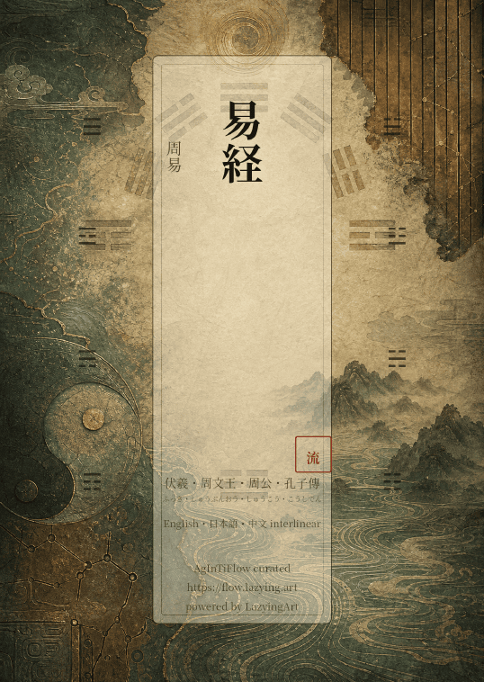 | `yijing` | 文言文 main · English · 日本語 · 中文 | [Read](https://learn.lazying.art/pdf-reader.html?path=docs/pocketpolyglot/books/wenyan-en-jp-zh/yijing/wenyan-main-quadrilingual/color/%E5%91%A8%E6%98%93%EF%BC%88%E8%8B%B1%E6%96%87%E3%83%BB%E7%8F%BE%E4%BB%A3%E6%97%A5%E6%9C%AC%E8%AA%9E%E3%83%BB%E7%8F%BE%E4%BB%A3%E4%B8%AD%E6%96%87%E6%B3%A8%EF%BC%89%E3%83%BB%E6%9C%80%E5%A4%A7%E8%AA%9E%E7%A8%AE%E3%83%BB%E5%A4%A7%E5%AD%97%E7%89%88.pdf&title=%E5%91%A8%E6%98%93%EF%BC%88%E8%8B%B1%E6%96%87%E3%83%BB%E7%8F%BE%E4%BB%A3%E6%97%A5%E6%9C%AC%E8%AA%9E%E3%83%BB%E7%8F%BE%E4%BB%A3%E4%B8%AD%E6%96%87%E6%B3%A8%EF%BC%89) | [Read](https://learn.lazying.art/pdf-reader.html?path=docs/pocketpolyglot/books/wenyan-en-jp-zh/yijing/wenyan-main-quadrilingual/blackwhite/%E5%91%A8%E6%98%93%EF%BC%88%E8%8B%B1%E6%96%87%E3%83%BB%E7%8F%BE%E4%BB%A3%E6%97%A5%E6%9C%AC%E8%AA%9E%E3%83%BB%E7%8F%BE%E4%BB%A3%E4%B8%AD%E6%96%87%E6%B3%A8%E3%83%BB%E9%BB%91%E7%99%BD%EF%BC%89%E3%83%BB%E6%9C%80%E5%A4%A7%E8%AA%9E%E7%A8%AE%E3%83%BB%E5%A4%A7%E5%AD%97%E7%89%88.pdf&title=%E5%91%A8%E6%98%93%EF%BC%88%E8%8B%B1%E6%96%87%E3%83%BB%E7%8F%BE%E4%BB%A3%E6%97%A5%E6%9C%AC%E8%AA%9E%E3%83%BB%E7%8F%BE%E4%BB%A3%E4%B8%AD%E6%96%87%E6%B3%A8%EF%BC%89%20black-white) |
| 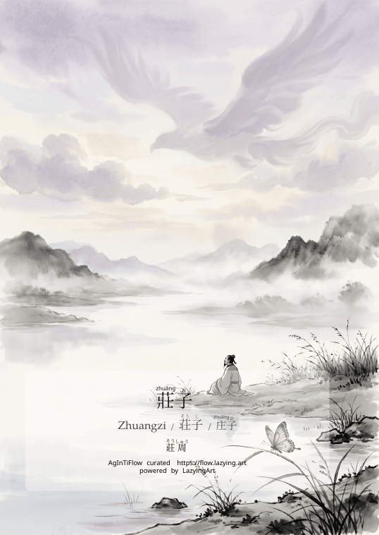 | `zhuangzi` | 文言文 main · English · 日本語 · 中文 | [Read](https://learn.lazying.art/pdf-reader.html?path=docs/pocketpolyglot/books/wenyan-en-jp-zh/zhuangzi/wenyan-main-quadrilingual/color/%E8%8E%8A%E5%AD%90%EF%BC%88%E8%8B%B1%E6%96%87%E3%83%BB%E7%8F%BE%E4%BB%A3%E6%97%A5%E6%9C%AC%E8%AA%9E%E3%83%BB%E7%8F%BE%E4%BB%A3%E4%B8%AD%E6%96%87%E6%B3%A8%EF%BC%89%E3%83%BB%E6%9C%80%E5%A4%A7%E8%AA%9E%E7%A8%AE%E3%83%BB%E5%A4%A7%E5%AD%97%E7%89%88.pdf&title=%E8%8E%8A%E5%AD%90%EF%BC%88%E8%8B%B1%E6%96%87%E3%83%BB%E7%8F%BE%E4%BB%A3%E6%97%A5%E6%9C%AC%E8%AA%9E%E3%83%BB%E7%8F%BE%E4%BB%A3%E4%B8%AD%E6%96%87%E6%B3%A8%EF%BC%89) | [Read](https://learn.lazying.art/pdf-reader.html?path=docs/pocketpolyglot/books/wenyan-en-jp-zh/zhuangzi/wenyan-main-quadrilingual/blackwhite/%E8%8E%8A%E5%AD%90%EF%BC%88%E8%8B%B1%E6%96%87%E3%83%BB%E7%8F%BE%E4%BB%A3%E6%97%A5%E6%9C%AC%E8%AA%9E%E3%83%BB%E7%8F%BE%E4%BB%A3%E4%B8%AD%E6%96%87%E6%B3%A8%E3%83%BB%E9%BB%91%E7%99%BD%EF%BC%89%E3%83%BB%E6%9C%80%E5%A4%A7%E8%AA%9E%E7%A8%AE%E3%83%BB%E5%A4%A7%E5%AD%97%E7%89%88.pdf&title=%E8%8E%8A%E5%AD%90%EF%BC%88%E8%8B%B1%E6%96%87%E3%83%BB%E7%8F%BE%E4%BB%A3%E6%97%A5%E6%9C%AC%E8%AA%9E%E3%83%BB%E7%8F%BE%E4%BB%A3%E4%B8%AD%E6%96%87%E6%B3%A8%EF%BC%89%20black-white) |
| 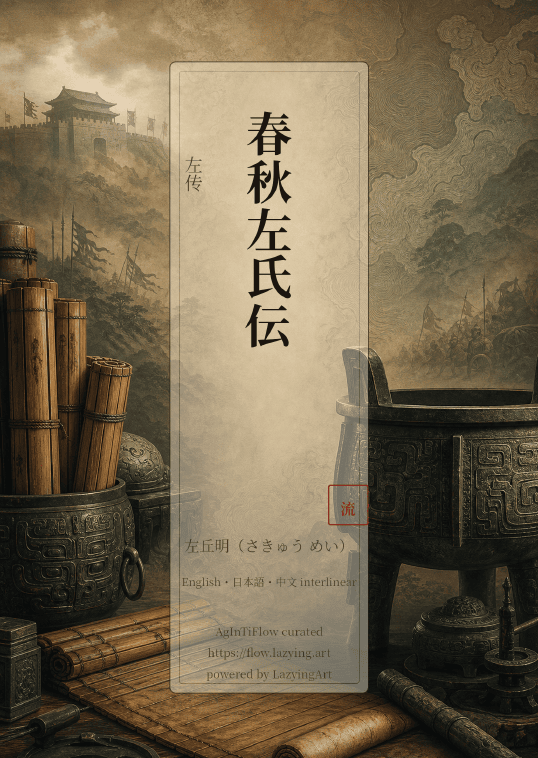 | `zuozhuan` | 文言文 main · English · 日本語 · 中文 | [Read](https://learn.lazying.art/pdf-reader.html?path=docs/pocketpolyglot/books/wenyan-en-jp-zh/zuozhuan/wenyan-main-quadrilingual/color/%E6%98%A5%E7%A7%8B%E5%B7%A6%E6%B0%8F%E5%82%B3%EF%BC%88%E8%8B%B1%E6%96%87%E3%83%BB%E7%8F%BE%E4%BB%A3%E6%97%A5%E6%9C%AC%E8%AA%9E%E3%83%BB%E7%8F%BE%E4%BB%A3%E4%B8%AD%E6%96%87%E6%B3%A8%EF%BC%89%E3%83%BB%E6%9C%80%E5%A4%A7%E8%AA%9E%E7%A8%AE%E3%83%BB%E5%A4%A7%E5%AD%97%E7%89%88.pdf&title=%E6%98%A5%E7%A7%8B%E5%B7%A6%E6%B0%8F%E5%82%B3%EF%BC%88%E8%8B%B1%E6%96%87%E3%83%BB%E7%8F%BE%E4%BB%A3%E6%97%A5%E6%9C%AC%E8%AA%9E%E3%83%BB%E7%8F%BE%E4%BB%A3%E4%B8%AD%E6%96%87%E6%B3%A8%EF%BC%89) | [Read](https://learn.lazying.art/pdf-reader.html?path=docs/pocketpolyglot/books/wenyan-en-jp-zh/zuozhuan/wenyan-main-quadrilingual/blackwhite/%E6%98%A5%E7%A7%8B%E5%B7%A6%E6%B0%8F%E5%82%B3%EF%BC%88%E8%8B%B1%E6%96%87%E3%83%BB%E7%8F%BE%E4%BB%A3%E6%97%A5%E6%9C%AC%E8%AA%9E%E3%83%BB%E7%8F%BE%E4%BB%A3%E4%B8%AD%E6%96%87%E6%B3%A8%E3%83%BB%E9%BB%91%E7%99%BD%EF%BC%89%E3%83%BB%E6%9C%80%E5%A4%A7%E8%AA%9E%E7%A8%AE%E3%83%BB%E5%A4%A7%E5%AD%97%E7%89%88.pdf&title=%E6%98%A5%E7%A7%8B%E5%B7%A6%E6%B0%8F%E5%82%B3%EF%BC%88%E8%8B%B1%E6%96%87%E3%83%BB%E7%8F%BE%E4%BB%A3%E6%97%A5%E6%9C%AC%E8%AA%9E%E3%83%BB%E7%8F%BE%E4%BB%A3%E4%B8%AD%E6%96%87%E6%B3%A8%EF%BC%89%20black-white) |
|  | `shiji-aginti` | 文言文 main · 日本語 · 中文 | [Read](https://learn.lazying.art/pdf-reader.html?path=docs/pocketpolyglot/books/wenyan-jp-zh/shiji-aginti/wenyan-main-jp-zh/color/%E5%8F%B2%E8%A8%98%EF%BC%88%E7%8F%BE%E4%BB%A3%E6%97%A5%E6%9C%AC%E8%AA%9E%E3%83%BB%E7%8F%BE%E4%BB%A3%E4%B8%AD%E6%96%87%E6%B3%A8%EF%BC%89%E3%83%BB%E6%9C%80%E5%A4%A7%E8%AA%9E%E7%A8%AE%E3%83%BB%E5%A4%A7%E5%AD%97%E7%89%88.pdf&title=%E5%8F%B2%E8%A8%98%EF%BC%88%E7%8F%BE%E4%BB%A3%E6%97%A5%E6%9C%AC%E8%AA%9E%E3%83%BB%E7%8F%BE%E4%BB%A3%E4%B8%AD%E6%96%87%E6%B3%A8%EF%BC%89) | [Read](https://learn.lazying.art/pdf-reader.html?path=docs/pocketpolyglot/books/wenyan-jp-zh/shiji-aginti/wenyan-main-jp-zh/blackwhite/%E5%8F%B2%E8%A8%98%EF%BC%88%E7%8F%BE%E4%BB%A3%E6%97%A5%E6%9C%AC%E8%AA%9E%E3%83%BB%E7%8F%BE%E4%BB%A3%E4%B8%AD%E6%96%87%E6%B3%A8%E3%83%BB%E9%BB%91%E7%99%BD%EF%BC%89%E3%83%BB%E6%9C%80%E5%A4%A7%E8%AA%9E%E7%A8%AE%E3%83%BB%E5%A4%A7%E5%AD%97%E7%89%88.pdf&title=%E5%8F%B2%E8%A8%98%EF%BC%88%E7%8F%BE%E4%BB%A3%E6%97%A5%E6%9C%AC%E8%AA%9E%E3%83%BB%E7%8F%BE%E4%BB%A3%E4%B8%AD%E6%96%87%E6%B3%A8%EF%BC%89%20black-white) |

PDF repository: [lachlanchen/LinguaLeaf](https://github.com/lachlanchen/LinguaLeaf) · Source repository: [lachlanchen/PocketPolyglot](https://github.com/lachlanchen/PocketPolyglot)
<!-- POCKETPOLYGLOT_MAX_LANGUAGE:END -->

## Featured Books

| [](how-to-speak-and-write/how-to-speak-and-write.pdf) | [](justice-with-michael-sandel/justice-with-michael-sandel.pdf) | [](https://github.com/lachlanchen/leonardsusskind) |
| --- | --- | --- |
| **How to Speak and Write** | **Justice with Michael Sandel** | **Leonard Susskind Book Repo** |

**How to Speak and Write** is now the most prominent published book from this repo.

First-page cover preview. Available as a full-size multilingual edition and as English pocket editions in `1.0x` and `1.2x`.

- Read the English local edition: [how-to-speak-and-write/how-to-speak-and-write.pdf](how-to-speak-and-write/how-to-speak-and-write.pdf)
- Read the Traditional Chinese local edition: [how-to-speak-and-write/how-to-speak-and-write-zh.pdf](how-to-speak-and-write/how-to-speak-and-write-zh.pdf)
- Read the Japanese local edition: [how-to-speak-and-write/how-to-speak-and-write-jp.pdf](how-to-speak-and-write/how-to-speak-and-write-jp.pdf)
- Read the pocket-size 1.0x edition: [how-to-speak-and-write/how-to-speak-and-write-pocket.pdf](how-to-speak-and-write/how-to-speak-and-write-pocket.pdf)
- Read the pocket-size 1.2x edition: [how-to-speak-and-write/how-to-speak-and-write-pocket-1_2x.pdf](how-to-speak-and-write/how-to-speak-and-write-pocket-1_2x.pdf)
- Read the website edition: [learn.lazying.art/how-to-speak-and-write-reader.html](https://learn.lazying.art/how-to-speak-and-write-reader.html)

**Justice with Michael Sandel** is also finished and published from the completed lecture pipeline.

First-page cover preview. Available as a full-size English edition and as English pocket editions in `1.0x` and `1.2x`.

- Read the English local edition: [justice-with-michael-sandel/justice-with-michael-sandel.pdf](justice-with-michael-sandel/justice-with-michael-sandel.pdf)
- Read the pocket-size 1.0x edition: [justice-with-michael-sandel/justice-with-michael-sandel-pocket.pdf](justice-with-michael-sandel/justice-with-michael-sandel-pocket.pdf)
- Read the pocket-size 1.2x edition: [justice-with-michael-sandel/justice-with-michael-sandel-pocket-1_2x.pdf](justice-with-michael-sandel/justice-with-michael-sandel-pocket-1_2x.pdf)
- Read the website edition: [learn.lazying.art/justice-with-michael-sandel-reader.html](https://learn.lazying.art/justice-with-michael-sandel-reader.html)

## Dedicated Physics Book Repo

There is also a separate repository dedicated to the Leonard Susskind lecture-note book collection.

- Browse the repo: [lachlanchen/leonardsusskind](https://github.com/lachlanchen/leonardsusskind)
- Use that repo for the larger physics catalog, including classical mechanics, advanced quantum mechanics, particle physics, entanglement, and string theory

## Book Layout

The book now has a strict split between source and publication:

- canonical editable lecture-note source lives in [generated_course_notes/lazylearn/how-you-speak-and-write](/home/lachlan/ProjectsLFS/LazyLearn/generated_course_notes/lazylearn/how-you-speak-and-write)
- the curated multilingual book source lives in [generated_course_notes/lazylearn/how-you-speak-and-write/how-to-speak-and-write](/home/lachlan/ProjectsLFS/LazyLearn/generated_course_notes/lazylearn/how-you-speak-and-write/how-to-speak-and-write)
- the root-level publication shelf lives in [how-to-speak-and-write](/home/lachlan/ProjectsLFS/LazyLearn/how-to-speak-and-write)

Current behavior:

- `generated_course_notes/...` keeps the editable source, cover assets, chapter structure, and translation source trees
- `how-to-speak-and-write/` keeps only the published PDFs:
  - English
  - Traditional Chinese
  - Japanese

Layout note:

- [references/how-to-speak-and-write-layout-plan.md](references/how-to-speak-and-write-layout-plan.md)

## 📌 At a glance

| Focus                | What this repo does                                    |
| -------------------- | ------------------------------------------------------ |
| Workflow type        | Reproducible physics + chemistry learning workspace    |
| Deliverables         | Scripts, notebooks, generated figures, and static docs |
| Collaboration model  | Root experiments + public site publishing              |
| Translation coverage | README mirror files in `i18n/`                         |

This repository is the code + notebook half of **LazyLearn**: an intentionally slow, practical learning log for knowledge and skill building. The living notes, wins, and TODOs are published at [learn.lazying.art](https://learn.lazying.art) (served from `docs/` in this repo), while runnable artifacts stay here so experiments always have a reproducible home.

## Overview 🧭

### LazyLearn

- **Home base:** [learn.lazying.art](https://learn.lazying.art) - the public-facing site with weekly focuses, backlog, and highlights.
- **Source of truth:** everything the site links to lives in `examples/`, `comp_physics/`, `comp_physics_python/`, `multiwfn/`, or `figures/`.
- **Update flow:** ship code/notebooks first, regenerate plots if needed, and then add an entry to `docs/` so the site reflects the latest work.

This repository is intentionally mixed-format, not a single packaged app. It combines executable scripts, notebooks, references, and a static docs site under one versioned workspace.

## Features ✨

- Quantum example scripts (QAOA + VQE) that run on commodity laptops.
- Computational physics notebooks and helper solvers (e.g., Numerov-based workflows).
- Chapter-by-chapter Python ports of textbook computational physics programs.
- Multiwfn source/manual bundle for local quantum chemistry post-processing reference.
- Versioned generated figures for reports/slides (`figures/`).
- Built-in multilingual README set under `i18n/`.
- Static microsite in `docs/` (custom domain: `learn.lazying.art`).

## Project structure 🗂️

### What lives here

| Path                   | Purpose                                                                                                                                            |
| ---------------------- | -------------------------------------------------------------------------------------------------------------------------------------------------- |
| `examples/`            | Focused Python scripts (QAOA + VQE) that run with Qiskit or PennyLane.                                                                             |
| `comp_physics/`        | Computational physics notebooks, helper scripts like `numerov.py`, and supporting data/figures.                                                    |
| `comp_physics_python/` | Python ports of Jos Thijssen's _Computational Physics_, organized by chapter (see [comp_physics_python/README.md](comp_physics_python/README.md)). |
| `multiwfn/`            | Multiwfn 3.8 developer source bundle plus manuals for local reference.                                                                             |
| `figures/`             | Static PNG/SVG outputs used in reports/slides and README.                                                                                          |
| `figs/`                | Logo and banner assets.                                                                                                                            |
| `docs/`                | LazyLearn microsite content (served by GitHub Pages or any static host).                                                                           |
| `i18n/`                | Localized README files.                                                                                                                            |
| `generated_course_notes/` | Canonical generated lecture-note source trees, chapter TeX, figures, compiled course artifacts, and book-source wrappers.                      |
| `how-to-speak-and-write/` | Publish-only shelf for the featured English, Traditional Chinese, and Japanese PDFs.                                                           |

Representative layout:

```text
LazyLearn/
|- README.md
|- docs/
|- i18n/
|- examples/
|- comp_physics/
|- comp_physics_python/
|- multiwfn/
|- figures/
|- figs/
|- Gaussian -> ../Gaussian/ (symlink)
|- ComputationalPhysics -> ../ComputationalPhysics/ (symlink)
|- leonardsusskind -> ../leonardsusskind/ (symlink)
`- the_theoretical_minimum -> ../the_theoretical_minimum/ (symlink)
```

> [!IMPORTANT]
> Several top-level entries are symlinks to directories outside this repository. Editing under those paths affects external targets.

## Prerequisites 🧰

| Requirement                        | Notes                                             |
| ---------------------------------- | ------------------------------------------------- |
| Python 3.x                         | Required for root scripts and most notebook work. |
| `pip` (or Conda)                   | Package/environment management.                   |
| Jupyter Lab/Notebook (optional)    | Needed for notebook workflows.                    |
| Gaussian 16 + GaussView (optional) | Needed for Gaussian workflows.                    |

## Installation ⚙️

### Minimal Python setup (root examples)

```bash
python -m venv .venv
source .venv/bin/activate
pip install --upgrade pip
pip install qiskit pennylane numpy matplotlib
```

### ✅ Quick setup checklist

| Step | Command                                         | Goal                                |
| ---- | ----------------------------------------------- | ----------------------------------- |
| 1    | `python -m venv .venv`                          | Create an isolated environment      |
| 2    | `source .venv/bin/activate` (or OS-equivalent)  | Avoid dependency conflicts          |
| 3    | `pip install --upgrade pip`                     | Ensure current package tooling      |
| 4    | `pip install qiskit pennylane numpy matplotlib` | Install the core experimental stack |
| 5    | Run one script in `examples/`                   | Validate installation end-to-end    |

Jupyter notebooks inside `comp_physics/` use the same environment. Launch with:

```bash
jupyter lab
# or
jupyter notebook
```

### Optional chapter-port dependencies (`comp_physics_python/`)

```bash
# conda activate quantum  # common local env name in subproject docs
pip install numpy scipy matplotlib
```

## Usage 🚀

### Example workflows

- **QAOA with Qiskit**

```bash
python examples/qaoa_qiskit_maxcut.py
```

No Aer dependency; uses a pure statevector backend.

- **QAOA with PennyLane**

```bash
python examples/qaoa_pennylane_maxcut.py
```

Uses `default.qubit`.

- **VQE for H2**

```bash
python examples/pennylane_chemistry_h2_vqe.py
```

Reproduces `figures/pennylane_h2_vqe_convergence.png`.

All scripts log intermediate metrics so you can reuse plots or extend to new molecules/graphs.

## Computational physics notebooks 📓

The `comp_physics/` directory mirrors working notes:

- `comp_physics_textbook_code/` - reusable routines extracted from notebooks.
- Standalone notebooks such as `chapter1.ipynb`, `chapter2.ipynb`, `numerov.ipynb`, and `numpy_1ddft.ipynb`.
- Topic folders (`bosonscattering/`, `lensless/`, `lightscattering/`, etc.) with data and helpers per experiment.

If extra dependencies are needed, record them in `comp_physics/environments.yaml`.

## Textbook code translations 📚

`comp_physics_python/` is a growing Python translation of the classic Fortran programs from _Computational Physics_. Example chapter mapping:

- `ch4/`: Hartree-Fock examples.
- `ch8/`: molecular dynamics solvers.
- `ch10/`: Monte Carlo samplers.

Refer to [comp_physics_python/README.md](comp_physics_python/README.md) for full chapter coverage and CLI commands.

## Multiwfn references 🔬

`multiwfn/` keeps `Multiwfn_3.8_dev_src_Linux` plus the PDF manual and quick-start guide. No compiled binaries are committed.

## Figures 🖼️

Generated PNG/SVG assets live in `figures/` so outputs are versioned alongside producing scripts/notebooks.

## Configuration 🛠️

### Python and notebooks

- Root scripts assume the venv shown above.
- Notebook environment details are distributed across project docs; no single lockfile currently exists at repo root.

### Gaussian runner (symlinked path)

`Gaussian/run_gaussian.sh` supports:

```bash
Gaussian/run_gaussian.sh [--no-view] [--g16 <path_to_g16>] [--gview <path_to_gview.sh>] <input.com|input.gjf>
```

Behavior:

- Writes `<basename>.log` next to input.
- Uses `GAUSS_SCRDIR` if set, otherwise defaults to `~/gaussian/scr`.
- Detects `%chk=...` in input; if checkpoint exists, GaussView opens `.chk`, otherwise `.log`.
- If available, prefers `~/gaussian/gv/gview_safe.sh`, then `gview.sh`.

Recommended GaussView wrapper:

```bash
#!/usr/bin/env bash
set -euo pipefail
GV_SH="$HOME/gaussian/gv/gview.sh"
export QT_QPA_PLATFORM="${QT_QPA_PLATFORM:-xcb}"
export LIBGL_ALWAYS_SOFTWARE="${LIBGL_ALWAYS_SOFTWARE:-1}"
export __GLX_VENDOR_LIBRARY_NAME="${__GLX_VENDOR_LIBRARY_NAME:-mesa}"
exec "$GV_SH" "$@"
```

## Development notes 🧪

### 🎬 Navigation map

Use this as a launchpad for daily work:

| Area                      | Start here             |
| ------------------------- | ---------------------- |
| Quantum demos             | `examples/`            |
| Physics notebooks         | `comp_physics/`        |
| Textbook translations     | `comp_physics_python/` |
| Quantum chemistry tools   | `multiwfn/`            |
| Published outputs         | `docs/`                |
| Figures and illustrations | `figures/`, `figs/`    |

### Version control notes

- Heavy paths are ignored via `.gitignore`, including `books/`, external symlink targets (`Gaussian`, `ComputationalPhysics`, `leonardsusskind`, `the_theoretical_minimum`), and local artifacts such as `*.chk`.
- Keep contributions focused on tracked folders for lightweight clone/update workflows.
- For website updates: edit `docs/`, preview locally, then push.

Local docs preview:

```bash
python -m http.server --directory docs
```

`docs/CNAME` is configured for `learn.lazying.art`.

## Troubleshooting 🩺

- Gaussian success criterion: `Normal termination of Gaussian` near the end of the `.log`.
- If GaussView fails under Wayland/remote sessions, use `gview_safe.sh` and pass `--gview` explicitly.
- If Gaussian scratch errors occur, verify free disk and permissions in `GAUSS_SCRDIR`.
- If notebook dependencies drift, treat subproject READMEs as source-of-truth and capture missing packages in environment files before sharing.
- `comp_physics/environments.yaml` appears to be a placeholder in the current repo state; rely on explicit install commands until it is corrected.

## Roadmap 🛣️

- Continue expanding `comp_physics_python/` chapter coverage (transfer matrices, DMC/PIMC, FEM, and beyond).
- Harmonize output/plot conventions across scripts and notebooks.
- Add lightweight, repeatable validation checks for key examples.
- Keep `docs/` and multilingual READMEs aligned with new experiments.

## Contribution 🤝

Issues and pull requests are welcome, especially for:

- Numerical correctness checks and reproducibility improvements.
- Better environment specifications for notebooks/scripts.
- Additional textbook chapter ports and CLI refinements.
- Documentation clarity across languages in `i18n/`.

Before submitting major content updates, keep generated figures in `figures/` and ensure commands are runnable from repository root unless otherwise documented.

## ❤️ Support

| Donate                                                                                                                                                                                                                                                                                                                                                     | PayPal                                                                                                                                                                                                                                                                                                                                                          | Stripe                                                                                                                                                                                                                                                                                                                                                              |
| ---------------------------------------------------------------------------------------------------------------------------------------------------------------------------------------------------------------------------------------------------------------------------------------------------------------------------------------------------------- | --------------------------------------------------------------------------------------------------------------------------------------------------------------------------------------------------------------------------------------------------------------------------------------------------------------------------------------------------------------- | ------------------------------------------------------------------------------------------------------------------------------------------------------------------------------------------------------------------------------------------------------------------------------------------------------------------------------------------------------------------- |
| [](https://chat.lazying.art/donate) | [](https://paypal.me/RongzhouChen) | [](https://buy.stripe.com/aFadR8gIaflgfQV6T4fw400) |

## License 📄

No root `LICENSE` file is currently present in this repository. Until a license is added, treat usage/redistribution rights as unspecified and request clarification from the maintainer before reusing substantial content.
